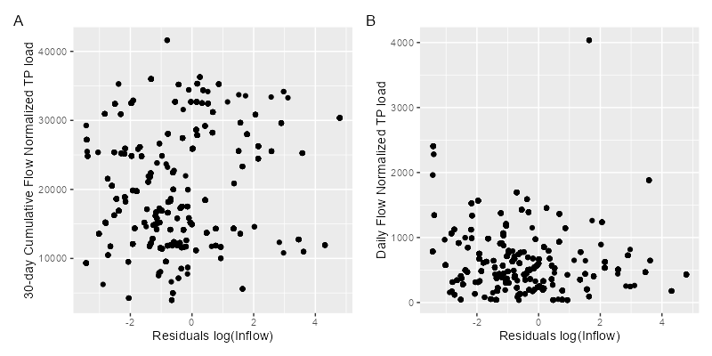

Thank you for the prompt and thorough review of my manuscript, "Linking watershed nutrient loading to estuary water quality with semiparametric models." I really appreciate the substantive and helpful comments from each of the reviewers. The final draft and
draft with differences marked are attached. Please note that the latexdiff tool
did not highlight the very minor changes in the abstract or references. I also would like to note the updated title based on comments from one reviewer.

Line by line comments and responses are included below (reviewer comments are italicized).
I have incorporated nearly all of the requested changes from the reviewers.

**Reviewer 1**

*Very well-structured abstract – introduced the problem, the objectives of the research, the results obtained, and the conclusion. No changes are recommended.*
*The introduction was well-structured and easy to follow. No changes are recommended.*

**Response:** Noted, and thank you.


*Line 114: A link to the USGS NWIS system could be added.*

**Response:** The url has been added.

*A brief description of the sample collection and laboratory analyses described in the QAPP and TCEQ procedures manual, detection and recovery limits, and instrumentation would seem appropriate.*

**Response:** I added the EPA methods and TCEQ's required AWRL's to Tables 1 and 2. I believe this is sufficient documentation.

*Also, what are the state-recommended guideline values? Include them in Table 2*

**Response:** I've added the associated state water quality criteria or screening levels in both Tables 1 and 2.

*Line 371 “has” repeated twice*

**Response:** This is fixed.

*The author adequately answered the research questions and fulfilled all the stated objectives. The results from the GAM model provided estimates of watershed nutrient loadings and an outlook of nutrient loading's influence on water quality.*
*The whole of the paper was well structured, easy to read, and contributes sufficiently to the existing body of knowledge on estuary anthropogenic pollution and water quality monitoring.*
*Through this paper, the author has created an addition to the body of work on using models for the prediction and assessment of pollution in estuaries and aquatic bodies, as a means of recommending and establishing policy actions for pollution mitigation.*

**Response:** Thank you for the review.

**Reviewer 3**

*Table 1: It would be helpful if you would include the watershed or station name under the USGS station ID in this table.*

**Response:** I've added the associated watersheds to each USGS station in Table 1.

*Line 164: Not sure if this is a typo, or if I’m missing what log1p(Q) is.*

**Response:** This was shorthand for *log(1+Q)*. I've changed this to *log(1+Q)* to be consistent with equation 1.

*Line 392, "Limitation" section: I expected this to be a discussion of limitations of the approach like matching daily loads to concentrations, the complex environmental factors that could be involved in chlorophyll and DO trends, changing climate, etc. However, since you focus on the (very valid) problem of limited sampling, you may want to rename this sub-section of the Discussion. Maybe call it "Data Needs" or "Suggested Management Focus" or something like that?*

*Line 53-54: Since only one of the trends you mention from Bugica is for a nitrogen species, I suggest rephrasing or expanding this sentence to explain why we’d be concerned about all of the parameters that are increasing (or clarify if we are only concerned about the TKN).*

*Lines 129-131: It would be helpful if you described how deep the water column is at the estuary sample locations and from what depth the samples that you analyzed were taken. A little more explanation of the estuary dynamics would be helpful too -- is this a stratified or well-mixed system, what is the range in salinity, is there a key season of concern for eutrophication?*

**Response:** I have added additional description of the estuary dynamics *(lines 101-108)*. Specifically mixing, turbidity, and salinity. Given the preliminary nature of this study, there is not a season of concern identified yet, so it is not included. *still need to add sample depth here*

*Lines 194-201: Some discussion is needed of how you dealt with temporal matching of flow and loads to concentrations in the estuary. I see in the discussion (line 373-374) that you matched flow and load estimated for the day of each sample. This approach should be explained in the methods, and I think you need some explanation is needed as to why that would be appropriate and/or how it may impact the results. As you discuss below, you might get better relationships (for Table 4, Lines 244-248) if you either lagged the match or matched an average load and flow from some reasonable period before the estuary sample date. If you had the ability to try some models like that, I think it may be a useful addition.*

**Response:** Dr. Marcus Beck made a similar comment in his review. This is now addressed
by incorporating cumulative flows and loads into the estuary models. **need to address this and justify it in the manuscript now**.


*Line 296: Would damming of the Navidad River impact the loads through the Lavaca River watershed? I don’t see why if the data was from the USGS-08164000 site.*

**Response:** You are absolutely correct. I mistakenly wrote this section considering the
combined watershed loads, when these estimates were for the Lavaca River watershed only.
I've removed this and incorporated your statement below. Thank you very much for catching this!


*Lines 286-321: I think this discussion is too long comparing the TP yield first to the Dunn study, and then to 3 other studies. The TP yield estimate from your study is in the middle of the others, so you can condense this 2 paragraph discussion and simply say that you fall in the middle of other estimates and state briefly that there are reasons such as land use and flow variability that the estimates vary.*

**Response:** I agree, this section has been considerably condensed.


*Lines 360-361: It is probably worthwhile to note that the effect of flow you see in chlorophyll is very likely due to more nutrients coming in with high flows. I wouldn’t want a reader to think that since your flow-adjusted nutrient loads are not linked to chlorophyll that this means there is definitely no impact of nutrients on chlorophyll concentrations. Along those lines, I’d suggest in Line 350-251 you specific that “No relationships between flow-adjusted inorganic nitrogen or TP loadings with chlorophyll-a were observed”*


**Reviewer: Marcus Beck**
*This article describes the use of Generalized Additive Models (GAMs) to estimate nutrient loads entering Lavica Bay from the main inflows. The author uses these models to evaluate the anthropogenic contribution of nutrients to the bay through flow-normalization and to evaluate if these loads are related to long-term variation in estuarine water quality. Overall, this is a valuable paper that further validates the use of GAMs for long-term trend analysis and will have particular value for the management of this system. My comments below relate to either clarification or adjustment of the methods that authors should consider. If pursued, I consider these changes appropriate for a major revision.*

**Response:** I'm highly appreciative of these comments, they have substantially improved the manuscript.

*I have some concerns about the methods starting on line 184 that describe how the load estimates are related to the estuarine data. First, I strongly encourage the authors to develop these models using cumulative or lagged estimates for the flow and load variables. It appears that these are currently modeled as the estimates for the same day the water quality parameter was sampled. I would not expect much of a relationship between water quality and the independent variables at that time scale. I suspect that the relationships the author shows regarding flow/load with the response reflects some level of temporal autocorrelation between the daily estimates and preceding conditions/loads, where the latter may be a truly causative relationship. I see two potential approaches to remedy the issue. One, the author could test different lagged values for flow and load, although this would require a bit of trial and error. A potentially better solution is to use the aggregate flow volume and load between the sample dates as a sum of the volume and mass, respectively, between each observation of the time series for the response variable. I would expect these aggregate measurements to be much more strongly correlated to the response variables than the daily values that are currently used. This limitation is noted on lines 371-374, so I’m curious why the authors did not use this approach.*

*My second concern about the models in eqns. 5-7 also relates to the flow and load variables. It’s stated on line 199-201 that flow-adjusted load values were used, which makes sense, but I don’t understand how this additional analysis differs from the flow-normalization in the previous section (lines 176 – 179). Why not just use the flow-adjusted loads from the previous models? Once this is clarified (or corrected), it might make more sense to change eqn 6 to include smoothers for ddate, yday, and flow-normalized load, and eqn 7 to included smoothers for ddate, yday, and load. These wouldn’t be “nested” models for AIC comparison, but would perhaps provide a better approach to evaluate loads related to natural or non-natural variation. I don’t see the value in including flow as a separate variable since it’s basically a surrogate for total load.*

**Response:** I am combining my response to both these comments since they are related. These are valid concerns and related to a comment made by Reviewer 3 (indicative that I better make a change here). 

(1) I agree that it makes more sense to utilize the flow normalized loading estimates generated in the previous section. The methodology and results have been adjusted to correct this. 

(2) I struggled with the concept of incorporating lag effects while developing these models, it didn't occur to me to utilize aggregated loads/flows. I believe this is an appropriate approach and will incorporate it into the models. However, since the estuary water quality data is not measured at equal intervals, the suggested aggregation method is potentially inappropriate. For example, if a quarterly measurement was missed you can end up aggregating 6 months of loads for a given data point instead of 3 months. Walker et al. (2021) found that after Hurricane Harvey (a massive magnitude storm) water quality impacts in Lavaca Bay and adjacent estuaries were restricted to a relatively short period, somewhere between 20 days and a few months. Based on this info, I am incorporating 1-day lagged, 20-day cumulative loads and flows into this set of models instead of the same day measures.  

(3) In regard to the suggestion for changing equations 6 and 7 to utilize loads and flow-normalized loads instead of flow: I suspect there are a number of different approaches available here. While it is correct that the flow variable is essentially a surrogate for total load, inclusion does allow us to assess the relative contribution of "natural" or streamflow/load driven variation compared to the variation driven by flow-normalized loads or human activities. The lack of co-variation between flow normalized loads (in particular the aggregated loads) and the flow variable (shown below)

```{r out.width="75%"}

```


*I also strongly encourage the author to consider replacing “semiparametric models” with “Generalized Additive Models” in the title. It’s a more accurate description of what’s included in the paper.*

**Response:** Title has been updated.

*Line 18: Maybe replace “non-natural variation” with “anthropogenic sources”.*

**Response:** Suggested changed made.

*Line 61: Accidental line break. *

**Response:** Fixed.


*Line 77: Suggest rephrasing as “…generalized linear models where the response variable is modeled as the sum of…”*

**Response:** Suggested change made.

*Tables 1 and 2: It would be useful to indicate the approximate sampling interval for the water quality parameters. It looks like quarterly. *

**Response:** I'm out of space in the tables, but include this in the text **(addline number)**.

*Line 102: Some more information about the Bay would be helpful. What is the average depth? Any information on residence time? Is the water column mixed, stratified, or seasonally-stratified?*

**Response:** I have not identified any information on residence time. I have added more information on average depth, mixing and stratification of the water column. **add line numbers**

*Lines 128 – 129: The interpretation of the figures, tables, and text would be much easier if the estuarine sites were simply referred to as “upper”, “mid”, and “lower”. I suggest replacing all station names with these terms throughout the manuscript. *

*Line 129 – 131: Some additional information about the sampling methods for the estuarine sites could be useful. Where in the water column were these samples taken? Is the water column mixed? I’m thinking specifically about dissolved oxygen. The results show that it was not related to load, but you may have different outcomes depending on surface vs bottom DO. *

*Line 138: Typo “tend”.*

**Response** Fixed typo.

*Figure 1: Remove “contribution” from the legend. *

**Response:** Suggested change made.

*Eqn 2: I think some additional details are needed in the text below this equation. Why was d set at 0.95? Based on the text, this seems awfully close to 1 or the “mean flow”. Also, the equation includes a lag term, t – t_j, but the size of this lag is not stated, i.e., “some historical day of observation”. Was this set explicitly by the author, and if so, is there a justification? *

**Response:** (1) I have updated the equation to (hopefully) be more clear about
the calculation. For each day in the record, the full record of flows is utilized (an admittedly not efficient calculation, but not an issue for a period of record the size of this data set). (2) I set *d* to 0.95 based on results from Robson and Dourdet (2015) and Zhang and Ball (2017), which is now discussed in **lines ...**

*Line 151: It’s not clear to me how fa is a unitless term. The equations show these as simple differences of average streamflow, so wouldn’t the units be in log-cfs? *

**Response:** I worded this incorrectly. I should have phrased this "dimensionless." This is fixed in **lines ...**

*Line 169: What percentage of the observations for each parameter were non-detects? I realize that setting the values as ½ the limit can introduce bias, but this may not be a big deal if there aren’t many non-detects. There does appear to be a GAM package that handles non-detects with Tobit models, but it is quite old (by software standards). It may be worth exploring. https://cran.r-project.org/web/packages/cenGAM/index.html*

**Response:** 4% of TP samples were below detection limits and 20% of NO~3~ 
samples fell below detection limits.
Early in this project 
I explored the use of the Tobit I family using the linked cenGAM package and 
unfortunately found the models result in large overestimation of concentrations.
I similarly explored the use of censored Gamma models in brms with similar 
results. Bergbusch et al. (2021) report similar findings. Conversely, Hayes 
et al. (2020) apply a censored GAM using brms without issue on microcystin 
concentration in lakes. brms appears promising for fitting censored water 
quality data, but I was frankly unable to fit reasonable models for this project
which might be due to sample size or my misunderstanding of model application.

*Line 236: This might be a personal preference, but “unusual periodic pattern” seems like regular periodicity and not a more random periodicity as one would expect with rain events. Consider rephrasing this text. *

**Response:** Rephrased to simply "periodic pattern." 

*Figure 2 caption: Consider adding a sentence like “Values closer to 1 for NSE and r and values closer to 0 for PBIAS represent more ideal goodness-of-fit assessments.”*

**Response:** Incorporated the suggested sentence.

*Figure 3 caption: Consider adding Lavaca and Navidad with the station name, as in the caption for figure 4. *

*Figure 5 caption: Consider including a reference to Table 3, as it wasn’t immediately clear to me that these models didn’t include flow or load. *

**Response:** Added a reference to Table 3.

*Table 4: As for my previous comment, I’d replace the site names with “upper”, “mid”, and “lower” and arrange them accordingly. The current arrangement is “mid”, “lower”, and “upper”. Also, it looks like several of the statistical summaries are identical, e.g. the inflow and inflow+load model for TP at TCEQ-13384. Are these simply rounding issues? And if so, are these models really all that different in terms of explained variance? *

**Respones:** I've replaced the site names and reordered the table based on location.
You are correct, the statistical summaries for several models are identical indicating that the more complicated models are not explaining additional variance.

*Line 272: The text “contributing tributaries” seems redundant. Maybe remove “contributing”. *

**Response:** Removed "contributing."

*Line 341: Replace “were” with “was”. *

**Response:** Fixed.

*Line 395: Replace “suggest” with “such as”.*

**Response:** Fixed.

*Line 420: Replace “provide” with “prove” or “be”.*

**Response:** Fixed.


## References

Hayes, Nicole M., Heather A. Haig, Gavin L. Simpson, and Peter R. Leavitt. 2020. “Effects of Lake Warming on the Seasonal Risk of Toxic Cyanobacteria Exposure.” Limnology and Oceanography Letters 5 (6): 393–402. https://doi.org/10.1002/lol2.10164.

Robson, Barbara J., and Vincent Dourdet. 2015. “Prediction of Sediment, Particulate Nutrient and Dissolved Nutrient Concentrations in a Dry Tropical River to Provide Input to a Mechanistic Coastal Water Quality Model.” Environmental Modelling & Software 63 (January): 97–108. https://doi.org/10.1016/j.envsoft.2014.08.009.

Walker, Lily M., Paul A. Montagna, Xinping Hu, and Michael S. Wetz. 2021. “Timescales and Magnitude of Water Quality Change in Three Texas Estuaries Induced by Passage of Hurricane Harvey.” Estuaries and Coasts 44 (4): 960–71. https://doi.org/10.1007/s12237-020-00846-6.

Zhang, Qian, and William P. Ball. 2017. “Improving Riverine Constituent Concentration and Flux Estimation by Accounting for Antecedent Discharge Conditions.” Journal of Hydrology 547 (April): 387–402. https://doi.org/10.1016/j.jhydrol.2016.12.052.


