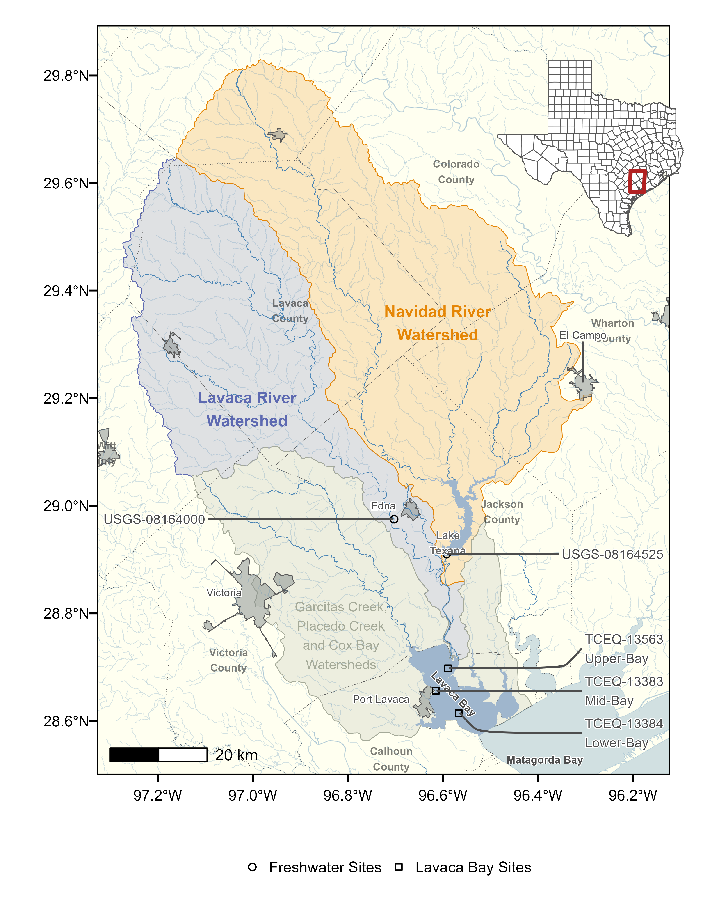

```{r setup, include=FALSE, echo=FALSE, message=FALSE, warning=FALSE}
knitr::opts_chunk$set(echo = FALSE,
                      out.extra = "") # This forces knitr to label all figures. 

library(targets)
library(knitr)
library(tidyverse)
library(kableExtra)
library(patchwork)
library(ggrepel)
library(rcartocolor)
library(twriTemplates)
library(ggspatial)
library(ragg)
library(modelsummary)
library(scico)
library(ggridges)
library(ggtext)
library(lubridate)
library(units)
library(gratia)
library(gt)


## this sets our default code chunk options
knitr::opts_chunk$set(echo = FALSE,
                      ## figure chunk options
                      dev = "ragg_png",
                      dpi = 300,
                      fig.align = "center",
                      out.width = "100%",
                      fig.process = 
                        function(filename) {
                          new_filename <- stringr::str_remove(string = filename,
                                                              pattern = "-1")
                          fs::file_move(path = filename, new_path = new_filename)
                          ifelse(fs::file_exists(new_filename), new_filename, filename)
                        }
                      )

options(knitr.kable.NA = '')
store <- "C:/Data-Analysis-Projects/lavaca-nutrients/_targets"
```


# Introduction {.unnumbered}

Similar to many coastal areas globally, the coastal watersheds along the Texas 
Gulf coast are facing pressures from growing populations, increases in point source 
and non-point source pollution and alterations to freshwater flows that degrade
water quality in downstream estuaries [@bricker_effects_2008; 
@kennicuttWaterQualityGulf2017; @bugica_water_2020]. 
Despite these escalating pressures, national scale assessments have classified 
coastal estuaries in Texas as moderate or low risk for eutrophic conditions 
[@bricker_effects_2008]. However, a suite of recent studies indicates that 
estuary water quality dynamics in both agricultural and urban dominated
watersheds within Texas are expressing conditions that are increasingly 
conducive to algal blooms and eutrophication [@wetzWaterQualityDynamics2016; 
@wetz_exceptionally_2017; @bugica_water_2020; @chinPhytoplanktonBiomassCommunity2022]. 
With identification of several localized areas of estuary water quality concern 
along the Texas coast [@bugica_water_2020], localized studies are being prioritized 
to better inform management actions.

The goal of this project is to assess watershed nutrient loading and the 
resulting water quality responses in Lavaca Bay, Texas. Lavaca Bay is a secondary bay in the larger
Matagorda Bay system located roughly halfway between Houston, Texas and Corpus
Christi, Texas. Lavaca Bay faces substantial challenges associated with
legacy contamination but general water quality parameters such as dissolved oxygen 
(DO), nutrients, and biological parameters have been well within state
water quality standards. Despite largely meeting state designated water quality 
thresholds, there have been concerning declines in abundance, biomass, and 
diversity of benthic fauna in Lavaca Bay [@beserespollackLongtermTrendsResponse2011]. 
These declines are partially attributed to reductions in freshwater inflow and 
changes in estuary salinity and are indicative of an already stressed system 
[@beserespollackLongtermTrendsResponse2011; @palmerImpactsDroughtsLow2015;
@montagnaAssessmentRelationshipFreshwater2020]. More recently, significant
linear increases in total phosphorus (TP), orthophosphate, 
total Kjeldahl nitrogen (TKN), and chlorophyll-*a* concentrations were identified
at monitoring sites within Lavaca Bay [@bugica_water_2020]. These trends in 
nutrient concentrations are concerning due to the role of nitrogen as a 
limiting factor for primary production in many Texas estuaries 
[@gardnerNitrogenFixationDissimilatory2006; @houTransformationFateNitrate2012;
@doradoUnderstandingInteractionsFreshwater2015; 
@paudelRelationshipSuspendedSolids2019; @wetz_exceptionally_2017] and the 
ramifications that changes in nitrogen loadings could have for 
productivity and eutrophication in Lavaca Bay.

There are ongoing efforts between local, state, and federal agencies to 
address water quality impairments in the freshwater portions of the 
Lavaca Bay watershed [@jainTechnicalSupportDocument2021; 
@schrammLavacaRiverWatershed2018; @bertholdDirectMailingEducation2021]. 
However, on a statewide scale, these approaches have shown limited success and 
emphasize a need for improved methods to assess and link management 
actions with downstream water quality [@schrammTotalMaximumDaily2022]. Such 
methods could help identify and replicate effective water quality 
management actions across the state . The identification and communication of 
changes and trends in water quality is 
complicated by the fact that trends are often non-linear and confounded by 
precipitation and runoff that hinder traditional analysis 
[@wazniakLinkingWaterQuality2007; @lloydMethodsDetectingChange2014]. 
The development and application of flexible statistical methods such as Weighted
Regressions on Time, Discharge and Season [WRTDS, @hirschWeightedRegressionsTime2010] 
and Generalized Additive Models [GAMs, @woodFastStableRestricted2011] have 
provided effective tools for researchers to quantify and
communicate non-linear changes in river and estuary pollutant loadings.

WRTDS calculates a time series of in-stream concentrations or loads 
(daily, monthly, or annually) and flow-normalized estimates of concentrations and loads
using locally weighted regression for unique combinations of time, discharge, and season. 
WRTDS has been widely used to assess and identify trends in riverine nutrients 
[@oelsner_recent_2019; @stackpooleLongTermMississippi2021],
chlorides [@stetsIncreasingChlorideRivers2018], and other pollutants of concern 
[@shodaWaterqualityTrendsRivers2019]. WRTDS has also been successfully adapted to 
assess trends in estuary water quality concentrations [@beckFourDecadesWater2018].

While WRTDS is a statistical approach developed specifically for water quality applications, 
GAMs are a broadly applicable statistical method. GAMs are a semiparametric 
extension of generalized linear models where the response variable is modeled
as the sum of multiple unknown smooth functions and parametric linear predictors
[@woodFastStableRestricted2011]. Although the underlying parameter estimation 
procedure of GAMs are substantially different than WRTDS, both the functional 
form and results have been demonstrated to be similar when assessing nutrient
concentration trends [@beckNumericalQualitativeContrasts2017]. 
Water quality applications of GAMs have included river and catchment 
nutrient concentration and load estimation
[@wangLoadEstimationUncertainties2011;@kroonRiverLoadsSuspended2012;
@kuhnertQuantifyingTotalSuspended2012;@robson_prediction_2015-1;
@hagemannEstimatingNutrientOrganic2016;@mcdowell_implications_2021;
@biagi_novel_2022], and assessment of temporal trends of nutrients
[@beckNumericalQualitativeContrasts2017; @murphyGeneralizedAdditiveModel2019],
phytoplankton [@bergbuschUnexpectedShiftPhytoplankton2021], 
and cyanobacteria [@hayesEffectsLakeWarming2020]. 
Recently GAMs have also been used to link water quality responses in 
receiving water bodies to changes in nonpoint source nutrient inputs 
[@murphyNutrientImprovementsChesapeake2022]. For a substantial discussion on the 
differences (and similarities) between GAMs and WRTDS for water quality 
applications readers are referred to @beckNumericalQualitativeContrasts2017.


To provide actionable information for resource managers in Lavaca Bay, 
water quality conditions must be evaluated relative to changes in natural 
environmental drivers to better understand and manage potential human impacts.
This study utilizes GAMs to develop estimates of delivered 
and flow-normalized nutrient loads and assess estuary water quality responses
to changes in loads delivered to 
Lavaca Bay. GAMs were chosen over other regression-based
approached for use in this study due to; (1) the ability to easily explore and 
incorporate different model terms; (2) the incorporation of non-linear smooth
functions that do not require explicit a priori knowledge of the expected
shape; and (3) inclusion of a link function that related the expected value of
the response to linear predictors thus avoiding unneeded data transformations
and bias corrections. The exploratory study also assesses the response of water 
quality parameters in Lavaca Bay over time and in response to freshwater inflow 
controlled for seasonality and to watershed nutrient loads that are controlled 
for environmentally driven variation.

# Methods and Materials {.unnumbered}

## Location and Data {.unnumbered}
Lavaca Bay is a 190 km^2^ estuary with the majority of freshwater inflow provided by the 
Lavaca and Navidad River systems (Fig.\ \ref{fig:fig1}). Lavaca Bay is relatively
shallow with an average depth of 1.2 m and a generally well mixed and turbid water column 
[@beserespollackLongtermTrendsResponse2011; @montagnaAssessmentRelationshipFreshwater2020].
The Garcitas-Arenosa, Placedo Creek, and Cox Bay subwatersheds provide additional 
freshwater inflows. The proximity to freshwater inputs in the upper Lavaca Bay
results in a strong mean salinity and variance gradient 
[@montagnaAssessmentRelationshipFreshwater2020]. Average salinity ranges from 
12 psu near the Lavaca River mouth to 23 psu at the mouth of Lavaca Bay. The
variance is inversely correlated with mean salinity.
The entire watershed area is 8,149 km^2^ and primarily rural. Watershed 
land cover and land use is 50% grazed pasture and rangeland, 20% cultivated 
cropland (primarily rows crops such as corn, cotton, and sorghum), and 5% 
suburban/urban. Pasture and rangeland is concentrated in the Lavaca River 
watershed, while cultivated crops are generally located along the eastern 
tributaries of the Navidad river. The Lavaca and Navidad River watersheds are a 
combined 5,966 km^2^, or approximately 73% of the entire Lavaca Bay watershed 
area. Discharge from the Navidad River is regulated by Lake Texana which has 
been in operation since 1980. Lake Texana provides 0.210 km^3^ of water 
storage and discharges into the tidal section of the Navidad River which 
ultimately joins the tidal section of the Lavaca River 15 km upstream of the 
confluence with the Lavaca Bay.

```{r fig1, fig.width=6.75, fig.width=5.2, out.width="5.2in", fig.cap="Map of Lavaca Bay watershed. The freshwater sites are the most downstream freshwater stream locations with water quality and streamflow data used for nutrient load models. Water quality concentration data at the three Lavaca Bay sites were used to assess relationships between freshwater flows, loads and estuary water quality."}




```

Daily discharges for the Lavaca River (USGS-08164000, Fig.\ \ref{fig:fig1}) 
were obtained from the United States Geologic Survey (USGS) National Water 
Information System (https://waterdata.usgs.gov/nwis) using the *dataRetrieval* R package 
[@deciccoDataRetrievalPackagesDiscovering2022]. Gaged daily discharges from 
the outlet of Lake Texana on the Navidad River (USGS-0816425) were provided by 
the Texas Water Development Board (TWDB) 
(April 21, 2022 email from R. Neupane, TWDB).

Water quality data for the two freshwater and three estuary locations were 
obtained from the Texas Commission on Environmental Quality (TCEQ) Surface Water 
Quality Monitoring Information System. Data submitted through the system 
are required to be collected under Quality Assurance Project Plans and lab 
method procedures outlined by the TCEQ's procedures manual. These operating 
procedures ensure consistent collection and laboratory methods are applied 
between samples collected by different entities and under different projects. 
All sites had varying time periods and availability of water quality data.
For freshwater locations, TP from January 2000 through December 2020 and 
nitrate-nitrogen (NO~3~) data from January 2005 through December 2020 were 
downloaded (Table\ \ref{tab:table1}). Less than 5-years of total
nitrogen and TKN concentration data were available at the freshwater sites and
deemed insufficient to develop load estimation models 
[@horowitzEvaluationSedimentRating2003; @snelderEstimationCatchmentNutrient2017]. 
The three estuary sites included an upper-bay site near the outlet of the
Lavaca River system (TCEQ-13563), a mid-bay site (TCEQ-13383), and the 
lower-bay site near the mouth of the Bay (TCEQ-13384). 
For estuary locations, we obtained data for TP, Nitrite+Nitrate (NO~*X*~), TKN, 
chlorophyll-*a*, and DO concentrations from January 2005 through December 2020 
(Table\ \ref{tab:table2}). All water quality data was collected approximately 
quarterly.

```{r table1}

df <- tar_read(model_data, store = store)

df <- df |>  
  select(Date, site_no, Flow, original_NO3, original_TP) |>
  mutate(site_no = case_when(
    site_no == "lktexana_g" ~ "usgs08164525",
    site_no != "lktexana_g" ~ site_no
  )) |>
  filter(site_no == "usgs08164000" |
           site_no == "usgs08164525") |> 
  rename(`NO\\textsubscript{3} (mg/L)` = original_NO3,
         `TP (mg/L)` = original_TP,
         `Station ID` = site_no,
         `Mean Daily Streamflow (cfs)` = Flow)
df$`Station ID` <- str_replace(df$`Station ID`, "usgs", "USGS-")

datasummary(`Station ID` * (`TP (mg/L)` + `NO\\textsubscript{3} (mg/L)` + `Mean Daily Streamflow (cfs)`) ~
               Mean*Arguments(na.rm=TRUE) + SD*Arguments(na.rm=TRUE) + N,
            data = df, output = "data.frame") |> 
  mutate(`Station ID` = c("USGS-08164000, Lavaca River", "USGS-08164000, Lavaca River", "USGS-08164000, Lavaca River",
                          "USGS-08164525, Navidad River", "USGS-08164525, Navidad River", "USGS-08164525, Navidad River")) |> 
  rename("Parameter" = " ",
         "Station ID and Watershed" = "Station ID") |> 
  mutate(Method = c("EPA 365.1", "EPA 353.2", "", "EPA 365.1", "EPA 353.2", ""),
         `AWRL\\textsuperscript{a}`= c(0.06, 0.05, NA, 0.06, 0.05, NA),
         `Criteria\\textsuperscript{b}` = c(0.69,1.95,NA,0.2,0.37,NA)) |> 
  kbl(format = "latex", booktabs = TRUE, escape = FALSE,
      caption = "Summary of gauged streamflow and freshwater water quality samples between January 1, 2000 and December 31, 2020.") |>
  column_spec(1:2, width = "2.5cm") |>
  collapse_rows(columns = 1, latex_hline = "major") |> 
  footnote(alphabet = c("Ambient water reporting limit (AWRL) represents the highest concentration that can be used as a reporting limit by a laboratory for inclusion in the state's monitoring data.",
                        "The state of Texas has not adopted numeric criteria for nutrients, these criteria represent screening levels used by the state for assessment purposes."),
           threeparttable = TRUE)

```


```{r table2}
#| warning: false

df <- tar_read(estuary_model_data, store = store)

df <- df |> 
  filter(station_id == "13384" |
         station_id == "13383" |
         station_id == "13563") |>
  filter(parameter_code == "00630" |
           parameter_code == "00625" |
           parameter_code =="00665" |
           parameter_code == "70953" |
           parameter_code == "00300") |> 
  filter(end_date >= as.Date("2005-01-01")) |> 
  select(end_date, station_id, station_description, parameter_description, parameter_code, value) |> 
  mutate(parameter_description =
           case_when(
             parameter_code == "70953" ~ "Chlorophyll-\\textit{a} (ug/L)",
             parameter_code == "00625" ~ "TKN (mg/L)",
             parameter_code == "00630" ~ "NO\\textsubscript{x} (mg/L)",
             parameter_code == "00665" ~ "TP (mg/L)",
             parameter_code == "00300" ~ "DO (mg/L)"
           )) |>
  mutate(station_id = paste0("TCEQ-", station_id)) |> 
  rename(`Station ID` = station_id) |> 
  pivot_wider(names_from = parameter_description,
              values_from = value)

modelsummary::datasummary(`Station ID` * (`TP (mg/L)`+
                           `NO\\textsubscript{x} (mg/L)` +
                           `TKN (mg/L)` +
                           `Chlorophyll-\\textit{a} (ug/L)` +
                           `DO (mg/L)`) ~
                           Mean*Arguments(na.rm=TRUE) + SD*Arguments(na.rm=TRUE) + N,
                         data = df, output = "data.frame") |> 
  mutate(`Station ID` = c(rep("TCEQ-13383", 5), rep("TCEQ-13384", 5),
                          rep("TCEQ-13563", 5))) |> 
  rename("Parameter" = " ") |> 
  mutate(`Station ID` = case_when(
    `Station ID` == "TCEQ-13383" ~ "TCEQ-13383, Mid-Bay",
    `Station ID` == "TCEQ-13384" ~ "TCEQ-13384, Lower-Bay",
    `Station ID` == "TCEQ-13563" ~ "TCEQ-13563, Upper-Bay"),
         Method = rep(c("EPA 365.1", "EPA 353.2", "EPA 351.2", "EPA 445.0", "ASTM D888-09(C) and TCEQ SOP V1"),3),
         `AWRL\\textsuperscript{a}`= rep(c(0.06, 0.05, 0.2, 3, NA),3),
         `Criteria\\textsuperscript{b}` = rep(c(0.21,NA,NA,11.6,5),3)) |>
  mutate(`Station ID` = fct_relevel(`Station ID`,
                                    "TCEQ-13563, Upper-Bay",
                                    "TCEQ-13383, Mid-Bay",
                                    "TCEQ-13384, Lower-Bay")) |> 
  arrange(`Station ID`) |> 
  kbl(format = "latex", booktabs = TRUE, escape = FALSE,
      caption = "Summary of estuary water quality samples collected between January 1, 2005 and December 31, 2020.") |>
  column_spec(1, width = "2cm") |>
  column_spec(6, width = "2.5cm") |>
  collapse_rows(columns = 1, latex_hline = "major") |>
  footnote(alphabet = c("Ambient water reporting limit (AWRL) represents the highest concentration that can be used as a reporting limit by a laboratory for inclusion in the state's monitoring data.",
                        "The state of Texas has not adopted numeric criteria for nutrients, these criteria represent screening levels used by the state for assessment purposes. NO\\\\textsubscript{x} and TKN parameters are not currently screened by the state and do not have an associated screening level."),
           threeparttable = T,
           escape = F)
```

## Estimating Watershed Based Nutrient Loads {.unnumbered}

Estimates of NO~3~ and TP loads at the Lavaca River (USGS-08164000) and the 
outlet of Lake Texana on the Navidad River (USGS-08164525) were developed using 
GAMs relating nutrient concentration to river discharge, season, and time.
Separate models were fit at each station for each parameter and used to predict
nutrient concentrations for each day in the study period. GAMs were fit using 
the *mgcv* package in R which makes available multiple 
types of smooth functions with automatic smoothness selection [@woodFastStableRestricted2011]. 
The general form of the model related NO~3~ or TP concentration to a long term
trend, season, streamflow, and two different antecedent discharge terms, 
shown in Eq. \ref{eq1}:

\begin{align}
g(\mu) &= \alpha + f_1(ddate) + f_2(yday) + f_3(log(1+Q)) + f_4(ma) + f_5(fa), \nonumber \\
y &\sim \mathcal{N}(\mu,\,\sigma^{2})
\label{eq1}
\end{align}

where $\mu$ is the conditional expected NO~3~ or TP concentration, $g()$ is the 
log-link, $\alpha$ is the intercept, $f_n()$ are smoothing functions. $y$ is the 
response variable (NO~3~ or TP concentration) modeled as normally distributed 
with mean $\mu$ and standard deviation $\sigma$. *ddate* is the date converted to 
decimal notation, *yday* is numeric day of year (1-366), and *Q* is the 
mean daily streamflow. 

Moving average (*ma*) is an exponentially smoothed moving average that attempts 
to incorporate the influence of prior streamflow events on concentration at the 
current time period [@wangLoadEstimationUncertainties2011;  
@kuhnertQuantifyingTotalSuspended2012; @wangSedimentConcentrationPrediction2013a; @zhang_improving_2017], using Eq. \ref{eq2}:

\begin{equation}
ma(d) = \frac{Q_j + dQ_{j-1} + \mathellipsis + d^{j-1}Q_1}{1+d+...+d^{j-1}}
\label{eq2}
\end{equation}

where *ma* at discount factor *d* is calculated using flows $(Q_1,Q_2,...,Q_j)$
for days 1 through *j*. Here, as *d* approaches zero, the time series 
becomes the daily observed values and as *d* gets closer to one, the time series 
becomes the mean flow. Although @kuhnertQuantifyingTotalSuspended2012 and 
@wangSedimentConcentrationPrediction2013a suggest using multiple covariates with
*d* set at different values from 0.75 to 0.99, @robson_prediction_2015-1 and 
@zhang_improving_2017 found substantial improvements in statistical nutrient 
models with *d*  equal to 0.95 which was adopted in this study.

Flow anomaly (*fa*) is a dimensionless term that represents how wet or dry 
(or how anomalous) the current time period is from previous time periods
[@vecchiaTrendsConcentrationsUse2009; @zhang_improving_2017]. 
Long-term flow anomaly (*ltfa*) is the streamflow over 
the previous year relative to the entire period 
[Eq.\ \ref{eq3}, @zhang_improving_2017] and 
and the short-term flow anomaly (*stfa*) calculated as the current day flow 
compared to the preceding 1-month streamflow [Eq.\ \ref{eq4}, @zhang_improving_2017]:

\begin{align}
ltfa(t) &= \bar{x}_{1\,year}(t) - \bar{x}_{entire\,period}, \label{eq3}\\
stfa(t) &= x_{current\,day}(t) - \bar{x}_{1\,month}(t) \label{eq4}
\end{align}

where $x$ are the averages of log-transformed streamflow over the antecedent 
period (*1-year*, *1-month*, etc.) for time *t*.  We used *ltfa* in NO~3~ models 
and *stfa* in TP models based on previous work demonstrating major improvements 
in NO~*X*~ regression models that incorporated 
*ltfa* and moderate improvements in TP regression models that incorporated 
*stfa* [@zhang_improving_2017]. Moving averages and flow anomalies were calculated
with the *adc* R package [@schrammAdcCalculateAntecedant2023].

The calculation of model terms for the Lake Texana site were modified
because daily loads are not a function of natural stream flow processes alone,
but of dam releases and nutrient concentrations at the discharge point of the 
lake. *Q*, *ma*, and *fa* terms were calculated based on total gaged inflow from
the 4 major tributaries to the lake. Thin-plate regression splines were used 
for *ddate*, *log(1+Q)*, *fa*, and *ma*. A cyclic cubic regression spline was 
used for *yday* to ensure the ends of the spline match 
(day 1 and day 366 are expected to match). First order penalties were applied 
to the smooths of flow-based variables which penalize departures from a 
flat function to help constrain extrapolations for high flow measurements. 

Left-censored data were not uncommon in this dataset. Several methods are
available to account for censored data. We transformed left-censored nutrient 
concentrations to one-half the detection limit. Although this simple approach 
can introduce bias [@hornungEstimationAverageConcentration1990],  we considered 
it acceptable because high concentrations and loadings are associated with 
high-flow events and low-flow/low-concentration events will account for a small 
proportion of total loadings [@mcdowell_implications_2021].

Daily loads were estimated as the predicted concentration multiplied by the 
daily streamflow. For the Navidad River (USGS-08164525) site, daily loads at the 
dam were calculated 
from the discrete daily concentration at the discharge point of the lake and 
corresponding reported daily discharge from the dam.
Flow-normalized loads were estimated similar to WRTDS by setting flow-based 
covariates on each day of the year equal to each of the historical values for
that day of the year over the study period [@hirschWeightedRegressionsTime2010]. The 
flow-normalized estimate was calculated as the mean of all the predictions for 
each day considering all possible flow values.
Standard deviations and 90% credible intervals were obtained by 
drawing samples from the multivariate normal posterior distribution of the 
fitted GAM [@woodConfidenceIntervalsGeneralized2006; 
@marraCoveragePropertiesConfidence2012; @mcdowell_implications_2021]. 
GAM performance was evaluated 
with repeated 5-fold cross validation  [@burmanComparativeStudyOrdinary1989] 
using average Nash-Sutcliffe Efficiency (NSE), Pearson sample correlation (*r*) 
and percent bias (PBIAS) metrics.

## Linking Estuary Water Quality to Hydrology and Nutrient Loads {.unnumbered}

To test if changes in freshwater inflow and nutrient loading had explanatory
effect on changes in estuary water quality a series of GAM models were fit at
each site relating parameter concentration to temporal trends (Eq.\ \ref{eq5}), 
temporal trends and inflow (Eq.\ \ref{eq6}), and temporal trends, inflow, and
nutrient loads (Eq.\ \ref{eq7}):
\begin{align}
g(\mu) &= \alpha + f_1(ddate) + f_2(yday), \label{eq5} \\
g(\mu) &= \alpha + f_1(ddate) + f_2(yday) + f_3(Q), \label{eq6} \\
g(\mu) &= \alpha + f_1(ddate) + f_2(yday) + f_3(Q) + f_4(Load) \label{eq7}
\end{align}

where $\mu$ is the conditional expected response (nutrient concentration), $g()$ 
is the log link, and response variable was modeled as Gamma distributed with 
mean $\mu$ and scale $\lambda$. $f_1(ddate)$ is decimal date smoothed with a 
thin-plate regression spline, $f_2(yday)$ is the numeric day of year smoothed 
with a cyclic cubic regression spline.
Prior work has shown that many water quality parameters may have lagged effects 
lasting days or even months following storms and large discharge events [@mooneyWatershedExportEvents2012a; 
@wetzExtremeFutureEstuaries2013; @bukaveckasInfluenceStormEvents2020; 
@walkerTimescalesMagnitudeWater2021]. @walkerTimescalesMagnitudeWater2021 showed
the impact of large flow events like Hurricane Harvey had somewhat short
water quality impacts in Lavaca Bay and adjacent estuary systems, ranging 
somewhere around 20 days to a few months. We incorporate this lag effect by using
cumulative totals for $f_3(Q)$ and $f_4(Load)$. $f_3(Q)$ is the cumulative of the 
previous 20 days of inflow (combined measurements from Lavaca River and 
Navidad River) and $f_4(Load)$ is the cumulative of the previous 20 days 
total NO~3~ or TP watershed load, both smoothed with thin plate regression 
splines. The set of models specified for each water
quality response are in Table\ \ref{tab:table3}.


```{r table3}
#| warning: false
df <- tibble(
  `Parameter` = c(rep("TP", 3), rep("NO\\textsubscript{x}", 3),
               rep("Chlorophyll-\\textit{a}", 3), rep("Dissolved Oxygen", 3),
               rep("TKN", 2)),
  Model = c("Temporal", "Flow", "Flow+Load",
            "Temporal", "Flow", "Flow+Load",
            "Temporal", "Flow", "Flow+Load",
            "Temporal", "Flow", "Flow+Load",
            "Temporal", "Flow"),
  `Model Terms` = c("s(ddate) + s(yday)",
                    "s(ddate) + s(yday) + s(Q)",
                    "s(ddate) + s(yday) + s(Q) + s(TP Load)",
                    "s(ddate) + s(yday)",
                    "s(ddate) + s(yday) + s(Q)",
                    "s(ddate) + s(yday) + s(Q) + s(NO\\textsubscript{3} Load)",
                    "s(ddate) + s(yday)",
                    "s(ddate) + s(yday) + s(Q)",
                    "s(ddate) + s(yday) + s(Q) + s(TP Load) + s(NO\\textsubscript{3} Load)",
                    "s(ddate) + s(yday)",
                    "s(ddate) + s(yday) + s(Q)",
                    "s(ddate) + s(yday) + s(Q) + s(TP Load) + s(NO\\textsubscript{3}  Load)",
                    "s(ddate) + s(yday)",
                    "s(ddate) + s(yday) + s(Q)")
)

kbl(df, format = "latex",
    caption = "Set of GAM models specified for each water quality parameter response.",
    booktabs = TRUE,
    escape = FALSE) |> 
  collapse_rows(columns = 1, latex_hline = "major")

```

Because streamflow and nutrient loads are tightly correlated, freshwater inflow
can mask signals due to changes in nutrient loads alone. Following the 
methodology implemented by @murphyNutrientImprovementsChesapeake2022,
both freshwater inflow and nutrient loads were prepossessed to account for season
and streamflow respectively. Cumulative inflow values were replaced by 
seasonally adjusted cumulative inflow obtained from the residuals of a GAM model 
fit between season(day of year) and log transformed cumulative inflow. Nutrient
loads utilized the flow-normalized loads estimated in the previous section.

This study used an information theoretic approach to evaluate 
evidence of model covariate effects on Lavaca Bay water quality.
Model probabilities were calculated 
and compared using the AIC~c~ scores between each group of temporal, inflow, and 
inflow+load models [@burnhamAICModelSelection2011]. Improvements in model 
probabilities provide evidence that the terms explain additional variation in 
the response variable.

# Results {.unnumbered}

## Watershed Nutrient Loads {.unnumbered}

Predictive performance of nutrient loads ranged from "satisfactory" to "very good"
based on standardized evaluation metrics of NSE, *r*, and PBIAS 
[@moriasiHydrologicWaterQuality2015] calculated using 5-fold cross validation.
Median goodness-of-fit metrics for NO~3~ models in the Lavaca 
River were 0.34 NSE, 0.70 *r*, and 2.00 PBIAS. Navidad River NO~3~ models 
appeared to perform slightly better with 0.48 NSE and 0.87 *r* but with higher 
bias at 10.90 PBIAS. Generally, TP models performed better than NO~3~ models. 
Median goodness-of-fit metrics for TP in the Lavaca River were 0.81 NSE, 
0.93 *r*, and -7.20 PBIAS. Navidad River TP models had similar performance 
with 0.91 NSE, 0.99 *r*, and -3.30 PBIAS. Density plots of
metrics show similar distribution of values between sites for the 
same parameter, with the exception *r* values for NO~3~ loads where 
Lavaca River had a much larger variance in values compared to the Navidad River
(Fig.\ \ref{fig:fig2}). TP GAMS had higher average NSE and *r* values and 
lower variance in metric values compared to NO~3~.

```{r fig2, warning=FALSE, message=FALSE, fig.width=6.85, fig.asp=0.65, fig.cap="Density plots of goodness-of-fit metrics (NSE, \\textit{r}, and PBIAS) from repeated 5-fold cross validation between predicted nutrient loads from GAM models and measured nutrient loads. Color indicates the tail probability calculated from the empirical cumulative distribution of the goodness-of-fit metrics. Values closer to 1 for NSE and r and values closer to 0 for PBIAS represent more ideal goodness-of-fit assessments.", dev='cairo_pdf'}


## some functions to overide scales in facets via dewey dunnington
#https://dewey.dunnington.ca/post/2018/modifying-facet-scales-in-ggplot2/
scale_override <- function(which, scale) {
  if(!is.numeric(which) || (length(which) != 1) || (which %% 1 != 0)) {
    stop("which must be an integer of length 1")
  }
  
  if(is.null(scale$aesthetics) || !any(c("x", "y") %in% scale$aesthetics)) {
    stop("scale must be an x or y position scale")
  }
  
  structure(list(which = which, scale = scale), class = "scale_override")
}

CustomFacetWrap <- ggproto(
  "CustomFacetWrap", FacetWrap,
  init_scales = function(self, layout, x_scale = NULL, y_scale = NULL, params) {
    # make the initial x, y scales list
    scales <- ggproto_parent(FacetWrap, self)$init_scales(layout, x_scale, y_scale, params)
    
    if(is.null(params$scale_overrides)) return(scales)
    
    max_scale_x <- length(scales$x)
    max_scale_y <- length(scales$y)
    
    # ... do some modification of the scales$x and scales$y here based on params$scale_overrides
    for(scale_override in params$scale_overrides) {
      which <- scale_override$which
      scale <- scale_override$scale
      
      if("x" %in% scale$aesthetics) {
        if(!is.null(scales$x)) {
          if(which < 0 || which > max_scale_x) stop("Invalid index of x scale: ", which)
          scales$x[[which]] <- scale$clone()
        }
      } else if("y" %in% scale$aesthetics) {
        if(!is.null(scales$y)) {
          if(which < 0 || which > max_scale_y) stop("Invalid index of y scale: ", which)
          scales$y[[which]] <- scale$clone()
        }
      } else {
        stop("Invalid scale")
      }
    }
    
    # return scales
    scales
  }
)

facet_wrap_custom <- function(..., scale_overrides = NULL) {
  # take advantage of the sanitizing that happens in facet_wrap
  facet_super <- facet_wrap(...)
  
  # sanitize scale overrides
  if(inherits(scale_overrides, "scale_override")) {
    scale_overrides <- list(scale_overrides)
  } else if(!is.list(scale_overrides) || 
            !all(vapply(scale_overrides, inherits, "scale_override", FUN.VALUE = logical(1)))) {
    stop("scale_overrides must be a scale_override object or a list of scale_override objects")
  }
  
  facet_super$params$scale_overrides <- scale_overrides
  
  ggproto(NULL, CustomFacetWrap,
          shrink = facet_super$shrink,
          params = facet_super$params
  )
}

df <- tar_read(cv_no3_08164000, store = store) |> 
  mutate(site = "USGS-08164000",
         parameter = "NO <sub>3</sub>") |> 
  bind_rows(
    tar_read(cv_tp_08164000, store = store) |> 
      mutate(site = "USGS-08164000",
             parameter = "TP")
  ) |> 
  bind_rows(
    tar_read(cv_no3_texana, store = store) |> 
      mutate(site = "USGS-08164525",
             parameter = "NO <sub>3</sub>")
  ) |> 
  bind_rows(
    tar_read(cv_tp_texana, store = store) |> 
      mutate(site = "USGS-08164525",
             parameter = "TP")
  ) |> 
  mutate(site = case_when(
    site == "USGS-08164525" ~ "Navidad",
    site == "USGS-08164000" ~ "Lavaca"
  ))

df_long <- df |> 
  ungroup() |> 
  select(NSE, r2, pbias, site, parameter) |> 
  pivot_longer(cols = c(NSE, r2, pbias),
               names_to = "metric")

## plots the density estimates of the repeated 5-fold cross-validation goodness-of-fit metric results,
## color indicates the tail probability calculated from the empirical cumulitive distribution of the goodness-of-fit metric values 
p1 <- ggplot(df, aes(y = site, x = NSE,
               fill = 0.5 - abs(0.5 - after_stat(ecdf)))) +
  stat_density_ridges(geom = "density_ridges_gradient",
                      calc_ecdf = TRUE,
                      n = 10000) +
  scale_fill_scico("Tail Probability", palette = "hawaii", direction = -1,
                   limit = c(0, 0.5), breaks = c(0, 0.1, 0.2, 0.3, 0.4)) +
  guides(fill = guide_colorbar(barwidth = unit(100L, "pt"),
                               title.position = "top")) +
  facet_wrap_custom(~parameter, scales = "free_x",
                    ncol = 2,
                    scale_overrides = list(
                      scale_override(1, scale_x_continuous(limits = c(-1,1),
                                                           expand = c(0,0),
                                                           breaks = c(-1,0,1))),
                      scale_override(2, scale_x_continuous(limits = c(0,1),
                                                           expand = c(0,0),
                                                           breaks = c(0,0.5,1)))
                    )) +
  labs(x = "NSE", y = "") +
  theme_TWRI_print(base_family = "Arial") +
  theme(axis.text = element_text(size = 8),
        axis.title.x = element_markdown(size = 8),
        strip.text.x = element_markdown(size = 8),
        strip.background = element_rect(fill = "white"),
        panel.spacing.x = unit(15L, "pt"),
        legend.direction = "horizontal",
        legend.text = element_text(size = 8),
        legend.title = element_text(size = 8),
        plot.margin = unit(c(1L,0L,1L,0L), "pt"))


p2 <- ggplot(df, aes(y = site, x = r2,
               fill = 0.5 - abs(0.5 - after_stat(ecdf)))) +
  stat_density_ridges(geom = "density_ridges_gradient",
                      calc_ecdf = TRUE,
                      n = 10000) +
  scale_fill_scico("Tail Probability", palette = "hawaii", direction = -1,
                   limit = c(0, 0.5), breaks = c(0, 0.1, 0.2, 0.3, 0.4)) +
  guides(fill = guide_colorbar(barwidth = unit(100L, "pt"),
                               title.position = "top")) +
  facet_wrap_custom(~parameter, scales = "free_x",
                    ncol = 2,
                    scale_overrides = list(
                      scale_override(1, scale_x_continuous(limits = c(0,1),
                                                           expand = c(0,0),
                                                           breaks = c(0,0.5,1))),
                      scale_override(2, scale_x_continuous(limits = c(0,1),
                                                           expand = c(0,0),
                                                           breaks = c(0,0.5,1)))
                    )) +
  labs(x = "*r*", y = "") +
  theme_TWRI_print(base_family = "Arial") +
  theme(axis.text = element_text(size = 8),
        axis.title.x = element_markdown(size = 8),
        strip.text.x = element_markdown(size = 8),
        strip.background = element_rect(fill = "white"),
        panel.spacing.x = unit(15L, "pt"),
        legend.direction = "horizontal",
        legend.text = element_text(size = 8),
        legend.title = element_text(size = 8),
        plot.margin = unit(c(0L,0L,1L,0L), "pt"))


p3 <- ggplot(df, aes(y = site, x = pbias,
               fill = 0.5 - abs(0.5 - after_stat(ecdf)))) +
  stat_density_ridges(geom = "density_ridges_gradient",
                      calc_ecdf = TRUE,
                      n = 10000) +
  scale_fill_scico("Tail Probability", palette = "hawaii", direction = -1,
                   limit = c(0, 0.5), breaks = c(0, 0.1, 0.2, 0.3, 0.4)) +
  guides(fill = guide_colorbar(barwidth = unit(100L, "pt"),
                               title.position = "top")) +
  facet_wrap_custom(~parameter, scales = "free_x",
                    ncol = 2,
                    scale_overrides = list(
                      scale_override(1, scale_x_continuous(limits = c(-150,200),
                                                           expand = c(0,0))),
                      scale_override(2, scale_x_continuous(limits = c(-75,75),
                                                           expand = c(0,0)))
                    )) +
  labs(x = "PBIAS", y = "") +
  theme_TWRI_print(base_family = "Arial") +
  theme(axis.text = element_text(size = 8),
        axis.title.x = element_markdown(size = 8),
        strip.text.x = element_markdown(size = 8),
        strip.background = element_rect(fill = "white"),
        panel.spacing.x = unit(15L, "pt"),
        legend.direction = "horizontal",
        legend.text = element_text(size = 8),
        legend.title = element_text(size = 8),
        axis.text.y = element_blank(),
        plot.margin = unit(c(0L,0.25,1L,0L), "pt"))

layout <- "
AAAA####
AAAA#DD#
AAAA####
BBBBCCCC
BBBBCCCC
BBBBCCCC
"

p4 <- p1 / p2 / p3 / guide_area() + plot_layout(guides = 'collect',
                                          design = layout)


p4

```


```{r echo=FALSE}
## calculates min and max load values and years
load_lav_no3 <- tar_read(daily_no3_08164000, store = store)
load_nav_no3 <- tar_read(daily_no3_texana, store = store)

load_lav_no3$annually |> 
  mutate(site = "Lavaca River") -> lavaca_no3_annually

load_nav_no3$annually |> 
  mutate(site = "Navidad River") -> navidad_no3_annually

mean_no3 <- scales::label_comma()(mean(lavaca_no3_annually$NO3_Estimate + navidad_no3_annually$NO3_Estimate ))
mean_no3_low <- scales::label_comma()(mean(lavaca_no3_annually$NO3_Lower + navidad_no3_annually$NO3_Lower ))
mean_no3_upper <- scales::label_comma()(mean(lavaca_no3_annually$NO3_Upper + navidad_no3_annually$NO3_Upper ))

no3 <- data.frame(lavaca = lavaca_no3_annually$NO3_Estimate,
                  navidad = navidad_no3_annually$NO3_Estimate,
                  year = lavaca_no3_annually$year)
no3 <- no3 |> 
  mutate(total = lavaca+navidad)

min_no3 <- min(no3$total)
min_no3_year <- no3[no3$total == min_no3,]$year
min_no3 <- scales::label_comma()(min_no3)


max_no3 <- max(no3$total)
max_no3_year <- no3[no3$total == max_no3,]$year
max_no3 <- scales::label_comma()(max_no3)

no3_prop <- no3 |> 
  mutate(prop = round(navidad/total, 2)) 

no3_mean_prop <- scales::label_percent()(mean(no3_prop$prop))

min_no3_prop <- scales::label_percent()(min(no3_prop$prop))


load_lav_tp <- tar_read(daily_tp_08164000, store = store)
load_nav_tp <- tar_read(daily_tp_texana, store = store)

load_lav_tp$annually |> 
  mutate(site = "Lavaca River") |> 
  filter(year >= 2005)-> lavaca_tp_annually

load_nav_tp$annually |> 
  mutate(site = "Navidad River") |> 
  filter(year >= 2005) -> navidad_tp_annually

mean_tp <- scales::label_comma()(mean(lavaca_tp_annually$TP_Estimate + navidad_tp_annually$TP_Estimate ))
mean_tp_low <- scales::label_comma()(mean(lavaca_tp_annually$TP_Lower + navidad_tp_annually$TP_Lower ))
mean_tp_upper <- scales::label_comma()(mean(lavaca_tp_annually$TP_Upper + navidad_tp_annually$TP_Upper ))

tp <- data.frame(lavaca = lavaca_tp_annually$TP_Estimate,
                  navidad = navidad_tp_annually$TP_Estimate,
                  year = lavaca_tp_annually$year)
tp <- tp |> 
  mutate(total = lavaca+navidad)

min_tp <- min(tp$total)
min_tp_year <- tp[tp$total == min_tp,]$year
min_tp <- scales::label_comma()(min_tp)


max_tp <- max(tp$total)
max_tp_year <- tp[tp$total == max_tp,]$year
max_tp <- scales::label_comma()(max_tp)

tp_prop <- tp |> 
  mutate(prop = round(navidad/total, 2)) 

tp_mean_prop <- scales::label_percent()(mean(tp_prop$prop))

min_tp_prop <- scales::label_percent()(min(tp_prop$prop))
```


Annual NO~3~ and TP loads show considerable variation, generally following
patterns in discharge (Fig.\ \ref{fig:fig3}, Fig. \ref{fig:fig4}). 
Flow-normalized TP loads at both sites and flow-normalized NO~3~ loads in the Lavaca River
indicated watershed based loads did not change much over time
when accounting for variation driven by streamflow (Fig.\ \ref{fig:fig3}). 
Flow-normalized loads in the Lavaca River showed small variation over time with 
some decreases in NO~3~ loads since 2013. 

```{r fig3, error=FALSE, warning=FALSE, message=FALSE, fig.width=6.85, fig.asp=0.7, fig.cap="Aggregated estimated annual and flow-normalized annual NO\\textsubscript{3} and TP loads for USGS-08164000 and USGS-08164525.", dev='cairo_pdf'}

load <- tar_read(daily_no3_08164000, store = store)
fn_load <- tar_read(daily_no3_08164000_fn, store = store)

load_lav_tp <- tar_read(daily_tp_08164000, store = store)
load_nav_tp <- tar_read(daily_tp_texana, store = store)

a <- ggplot() +
  geom_point(data = load$annually, aes(year, NO3_Estimate,
                                   color = "Total Annual Load + 90% CI",
                                   shape = "Total Annual Load + 90% CI")) +
  geom_line(data = load$annually, aes(x = year, y = NO3_Estimate,
                                  color = "Total Annual Load + 90% CI",
                                  linetype = "Total Annual Load + 90% CI"),
            alpha = 0.5) +
  geom_linerange(data = load$annually, aes(x = year, ymin = NO3_Lower, ymax = NO3_Upper,
                                       color = "Total Annual Load + 90% CI")) +
  geom_point(data = fn_load$annually, aes(year, NO3_Estimate,
                                 color = "Flow-Normalized Annual Load + 90% CI",
                                 shape = "Flow-Normalized Annual Load + 90% CI")) +
  geom_line(data = fn_load$annually,
            aes(x = year, y = NO3_Estimate,
                color = "Flow-Normalized Annual Load + 90% CI",
                linetype = "Flow-Normalized Annual Load + 90% CI"),
            alpha = 0.5) +
  geom_linerange(data = fn_load$annually,
                 aes(x = year, ymin = NO3_Lower, ymax = NO3_Upper,
                     color = "Flow-Normalized Annual Load + 90% CI")) +
  labs(x = "", 
       y = expression(Annual~NO[3]~Load~"[kg]"), 
       subtitle = "Lavaca River") +
  scale_shape_manual(name = "values",
                     values = c(21, 19)) +
  scale_color_manual(name = "values",
                     values = c("#7E1900", "#1A3399")) +
  scale_linetype_manual(name = "values",
                        values = c(1, 2)) +
  scale_y_continuous(trans = "pseudo_log",
                     breaks = c(0,1E1, 1E2, 1E3, 1E4, 1E5, 1E6, 1E7),
                     labels = scales::label_log()) +
  coord_cartesian(ylim = c(1000, 1E7)) +
  theme_TWRI_print(base_family = "sans") +
  theme(axis.title.y = element_text(size = 8),
        axis.text.x = element_blank(),
        plot.subtitle = element_text(size = 8, hjust = 0.5, face = "bold"),
        panel.grid.major.x = element_line(color = "#d9d9d9",
                                          linetype = "dotted"),
        legend.title = element_blank(),
        legend.text = element_text(size = 8),
        plot.margin = unit(c(0L,3L,0L,0L), "pt"))


load <- tar_read(daily_no3_texana, store = store)
fn_load <- tar_read(daily_no3_texana_fn, store = store)

b <- ggplot() +
  geom_point(data = load$annually, aes(year, NO3_Estimate,
                                   color = "Total Annual Load + 90% CI",
                                   shape = "Total Annual Load + 90% CI")) +
  geom_line(data = load$annually, aes(x = year, y = NO3_Estimate,
                                  color = "Total Annual Load + 90% CI",
                                  linetype = "Total Annual Load + 90% CI"),
            alpha = 0.5) +
  geom_linerange(data = load$annually, aes(x = year, ymin = NO3_Lower, ymax = NO3_Upper,
                                       color = "Total Annual Load + 90% CI")) +
  geom_point(data = fn_load$annually, aes(year, NO3_Estimate,
                                 color = "Flow-Normalized Annual Load + 90% CI",
                                 shape = "Flow-Normalized Annual Load + 90% CI")) +
  geom_line(data = fn_load$annually,
            aes(x = year, y = NO3_Estimate,
                color = "Flow-Normalized Annual Load + 90% CI",
                linetype = "Flow-Normalized Annual Load + 90% CI"),
            alpha = 0.5) +
  geom_linerange(data = fn_load$annually,
                 aes(x = year, ymin = NO3_Lower, ymax = NO3_Upper,
                     color = "Flow-Normalized Annual Load + 90% CI")) +
  labs(x = "", 
       y = expression(Annual~NO[3]~Load~"[kg]"), 
       subtitle = "Navidad River") +
  scale_shape_manual(name = "values",
                     values = c(21, 19)) +
  scale_color_manual(name = "values",
                     values = c("#7E1900", "#1A3399")) +
  scale_linetype_manual(name = "values",
                        values = c(1, 2)) +
  scale_y_continuous(trans = "pseudo_log",
                     breaks = c(0,1E1, 1E2, 1E3, 1E4, 1E5, 1E6, 1E7),
                     labels = scales::label_log()) +
  coord_cartesian(ylim = c(1000, 1E7)) +
  theme_TWRI_print(base_family = "sans") +
  theme(axis.title.y = element_blank(),
        axis.text.y = element_blank(),
        axis.text.x = element_blank(),
        plot.subtitle = element_text(size = 8, hjust = 0.5, face = "bold"),
        panel.grid.major.x = element_line(color = "#d9d9d9",
                                          linetype = "dotted"),
        legend.title = element_blank(),
        legend.text = element_text(size = 8),
        plot.margin = unit(c(0L,0L,0L,3L), "pt"))

load <- tar_read(daily_tp_08164000, store = store)
fn_load <- tar_read(daily_tp_08164000_fn, store = store)

load$annually <- load$annually |> 
  filter(year >= 2005)

fn_load$annually <- fn_load$annually |> 
  filter(year >= 2005)

c <- ggplot() +
  geom_point(data = load$annually, aes(year, TP_Estimate,
                                   color = "Total Annual Load + 90% CI",
                                   shape = "Total Annual Load + 90% CI")) +
  geom_line(data = load$annually, aes(x = year, y = TP_Estimate,
                                  color = "Total Annual Load + 90% CI",
                                  linetype = "Total Annual Load + 90% CI"),
            alpha = 0.5) +
  geom_linerange(data = load$annually, aes(x = year, ymin = TP_Lower, ymax = TP_Upper,
                                       color = "Total Annual Load + 90% CI")) +
  geom_point(data = fn_load$annually, aes(year, TP_Estimate,
                                 color = "Flow-Normalized Annual Load + 90% CI",
                                 shape = "Flow-Normalized Annual Load + 90% CI")) +
  geom_line(data = fn_load$annually,
            aes(x = year, y = TP_Estimate,
                color = "Flow-Normalized Annual Load + 90% CI",
                linetype = "Flow-Normalized Annual Load + 90% CI"),
            alpha = 0.5) +
  geom_linerange(data = fn_load$annually,
                 aes(x = year, ymin = TP_Lower, ymax = TP_Upper,
                     color = "Flow-Normalized Annual Load + 90% CI")) +
  labs(x = "", y = "Annual TP Load [kg]", subtitle = "Lavaca River") +
  scale_shape_manual(name = "values",
                     values = c(21, 19)) +
  scale_color_manual(name = "values",
                     values = c("#7E1900", "#1A3399")) +
  scale_linetype_manual(name = "values",
                        values = c(1, 2)) +
  scale_y_continuous(trans = "pseudo_log",
                     breaks = c(0,1E1, 1E2, 1E3, 1E4, 1E5, 1E6, 1E7),
                     labels = scales::label_log()) +
  coord_cartesian(ylim = c(1000, 1E6)) +
  theme_TWRI_print(base_family = "sans") +
  theme(axis.title.y = element_text(size = 8),
        panel.grid.major.x = element_line(color = "#d9d9d9",
                                          linetype = "dotted"),
        legend.title = element_blank(),
        legend.text = element_text(size = 8),
        plot.margin = unit(c(0L,3L,0L,0L), "pt"),
        plot.subtitle = element_blank())


load <- tar_read(daily_tp_texana, store = store) 
fn_load <- tar_read(daily_tp_texana_fn, store = store)

load$annually <- load$annually |> 
  filter(year >= 2005)

fn_load$annually <- fn_load$annually |> 
  filter(year >= 2005)

d <- ggplot() +
  geom_point(data = load$annually, aes(year, TP_Estimate,
                                   color = "Total Annual Load + 90% CI",
                                   shape = "Total Annual Load + 90% CI")) +
  geom_line(data = load$annually, aes(x = year, y = TP_Estimate,
                                  color = "Total Annual Load + 90% CI",
                                  linetype = "Total Annual Load + 90% CI"),
            alpha = 0.5) +
  geom_linerange(data = load$annually, aes(x = year, ymin = TP_Lower, ymax = TP_Upper,
                                       color = "Total Annual Load + 90% CI")) +
  geom_point(data = fn_load$annually, aes(year, TP_Estimate,
                                 color = "Flow-Normalized Annual Load + 90% CI",
                                 shape = "Flow-Normalized Annual Load + 90% CI")) +
  geom_line(data = fn_load$annually,
            aes(x = year, y = TP_Estimate,
                color = "Flow-Normalized Annual Load + 90% CI",
                linetype = "Flow-Normalized Annual Load + 90% CI"),
            alpha = 0.5) +
  geom_linerange(data = fn_load$annually,
                 aes(x = year, ymin = TP_Lower, ymax = TP_Upper,
                     color = "Flow-Normalized Annual Load + 90% CI")) +
  labs(x = "", y = "Annual TP Load [kg]", subtitle = "Navidad River") +
  scale_shape_manual(name = "values",
                     values = c(21, 19)) +
  scale_color_manual(name = "values",
                     values = c("#7E1900", "#1A3399")) +
  scale_linetype_manual(name = "values",
                        values = c(1, 2)) +
  scale_y_continuous(trans = "pseudo_log",
                     breaks = c(0,1E1, 1E2, 1E3, 1E4, 1E5, 1E6, 1E7),
                     labels = scales::label_log()) +
  coord_cartesian(ylim = c(1000, 1E6)) +
  theme_TWRI_print(base_family = "sans") +
  theme(axis.title.y = element_blank(),
        axis.text.y = element_blank(),
        panel.grid.major.x = element_line(color = "#d9d9d9",
                                          linetype = "dotted"),
        legend.title = element_blank(),
        legend.text = element_text(size = 8),
        plot.margin = unit(c(0L,1L,0L,3L), "pt"),
        plot.subtitle = element_blank())

layout <- "
11112222
11112222
11112222
11112222
33334444
33334444
33334444
33334444
55555555
"

a + b + c + d + guide_area() + plot_layout(guides = 'collect', design = layout)
```

Aggregated across both sites, the mean 
annual NO~3~ load from 2005 through 2020 was `r mean_no3` kg (`r mean_no3_low` kg - 
`r mean_no3_upper` kg, 90% CI). Annual NO~3~ loads ranged from `r min_no3` kg 
in `r min_no3_year` to `r max_no3` kg in `r max_no3_year`. Total annual TP loads 
ranged from `r min_tp` kg in `r min_tp_year` to 
`r max_tp` kg  in `r max_tp_year`. Mean annual TP loading from 2005 through 2020
was `r mean_tp` kg (`r mean_tp_low` kg - `r mean_tp_upper` kg, 90% CI).
On average, the Navidad River accounted for `r no3_mean_prop` of NO~3~ loads and 
`r tp_mean_prop` of TP loads from 2005 through 2020. However, during periods of extreme 
drought the Lavaca River became the primary source of 
nutrient loading in the watershed with the Navidad River only accounting for 
`r min_no3_prop` and `r min_tp_prop` of NO~3~ and TP loads in 2011 
(Fig.\ \ref{fig:fig4}).

```{r fig4, error=FALSE, message=FALSE, warning=FALSE, fig.width=3.3, fig.asp=2, fig.cap="Comparison of delivered annual loads and annual discharge at the Lavaca (USGS-08164000) and Navidad (USGS-08164525) Rivers.", out.width="0.5\\linewidth", dev='cairo_pdf'}

load_lav_no3 <- tar_read(daily_no3_08164000, store = store)
load_nav_no3 <- tar_read(daily_no3_texana, store = store)

load_lav_no3$annually |> 
  mutate(site = "Lavaca River") -> lavaca_no3_annually

load_nav_no3$annually |> 
  mutate(site = "Navidad River") -> navidad_no3_annually


no3_annual <- bind_rows(lavaca_no3_annually, navidad_no3_annually) |> 
  mutate(x = as.Date(paste0(year, "-01-01"), "%Y-%m-%d"))

# b <- ggplot(no3_annual) +
#   geom_col(aes(year, NO3_Estimate, fill = site), width = 0.8) +
#   scale_x_continuous(expand = expansion(mult = c(0.05, 0.05)), 
#                      breaks = c(2005, 2010, 2015, 2020)) +
#   scale_y_continuous(labels = scales::comma) +
#   scale_fill_carto_d(palette = "Vivid", direction = -1) +
#   labs(x = "", 
#        y = "Predicted Annual<br>NO <sub>3</sub> Load [kg]") +
#   theme_TWRI_print(base_family = "Arial") +
#   theme(axis.title.y = element_text(size = 8),
#         axis.text = element_text(size = 8),
#         panel.grid.major.x = element_line(color = "#d9d9d9",
#                                           linetype = "dotted"),
#         legend.title = element_blank(),
#         legend.text = element_text(size = 8))


prop <- no3_annual |> 
  mutate(proportion = NO3_Estimate/sum(NO3_Estimate))

ylab1 <- expression(Annual~NO[3]~Load)
ylab2 <- expression("[Proportion]")
c <- ggplot() +
  geom_col(data = prop, aes(year, proportion, fill  = site)) +
  scale_fill_carto_d(palette = "Vivid", direction = -1) +
  scale_x_continuous(breaks = c(2005, 2010, 2015, 2020),
                     expand = expansion(mult = c(0.05, 0.05))) +
  scale_y_continuous(expand = c(0,0)) +
  labs(x = "",
       y = "")  +
  coord_cartesian(clip = "off") +
  annotation_custom(grid::textGrob(ylab1,
                                   x = unit(-0.23, "npc"),
                                   rot = 90,
                                   gp = grid::gpar(fontfamily = "sans",
                                             fontsize = 8))) +
  annotation_custom(grid::textGrob(ylab2,
                                   x = unit(-0.18, "npc"),
                                   rot = 90,
                                   gp = grid::gpar(fontfamily = "sans",
                                                   fontsize = 8))) +
  theme_TWRI_print(base_family = "sans") +
  theme(axis.title.y = element_text(size = 8),
        axis.text = element_text(size = 8),
        panel.grid.major.x = element_line(color = "#d9d9d9",
                                          linetype = "dotted"),
        legend.title = element_blank(),
        legend.text = element_text(size = 8))


ylab1 <- expression("Annual Discharge")
ylab2 <- expression("[Million Gallons]")
d <- tar_read(qdata, store = store) |>
  filter(site_no %in% c("8164000", "lktexana_g")) |>
  filter(Date >= as.Date("2005-01-01")) |>
  mutate(site = case_when(
    site_no == "8164000" ~ "Lavaca River",
    site_no == "lktexana_g" ~ "Navidad River"
  )) |>
  mutate(year = year(Date)) |>

  mutate(Flow = as_units(Flow, "ft^3/s")) |>
  mutate(Flow = set_units(Flow, "ft^3/day")) |>
  mutate(Flow = set_units(Flow, "1E6gallons/day")) |>
  group_by(year, site) |>
  summarise(Flow = sum(Flow, na.rm = TRUE)) |>
  mutate(Flow = drop_units(Flow)) |>
  ggplot() +
  geom_col(aes(year, Flow, fill = site)) +
  scale_fill_carto_d(palette = "Vivid", direction = -1) +
  scale_x_continuous(breaks = c(2005, 2010, 2015, 2020),
                     expand = expansion(mult = c(0.05, 0.05))) +
  scale_y_continuous(expand = c(0,0)) +
  labs(x = "",
       y = "") +
  coord_cartesian(clip = "off") +
  annotation_custom(grid::textGrob(ylab1,
                                   x = unit(-0.25, "npc"),
                                   rot = 90,
                                   gp = grid::gpar(fontfamily = "sans",
                                             fontsize = 8))) +
  annotation_custom(grid::textGrob(ylab2,
                                   x = unit(-0.20, "npc"),
                                   rot = 90,
                                   gp = grid::gpar(fontfamily = "sans",
                                                   fontsize = 8))) +
  theme_TWRI_print(base_family = "Arial") +
  theme(axis.title.y = element_text(size = 8),
        axis.text = element_text(size = 8),
        panel.grid.major.x = element_line(color = "#d9d9d9",
                                          linetype = "dotted"),
        legend.title = element_blank(),
        legend.text = element_text(size = 8),
        legend.position = "none",
        plot.margin = unit(c(1L,1L,1L,2L), "pt"))


load_lav_tp$annually |>
  mutate(site = "Lavaca River") -> lavaca_tp_annually

load_nav_tp$annually |>
  mutate(site = "Navidad River") -> navidad_tp_annually


tp_annual <- bind_rows(lavaca_tp_annually, navidad_tp_annually) |>
  filter(year >= 2005) |>
  mutate(x = as.Date(paste0(year, "-01-01"), "%Y-%m-%d"))
# 
# e <- ggplot(tp_annual) +
#   geom_col(aes(year, TP_Estimate, fill = site), width = 0.8) +
#   scale_x_continuous(expand = expansion(mult = c(0.05, 0.05)), 
#                      breaks = c(2005, 2010, 2015, 2020)) +
#   scale_y_continuous(labels = scales::comma) +
#   scale_fill_carto_d(palette = "Vivid", direction = -1) +
#   labs(x = "", y = "Predicted Annual<br>TP Load [kg]") +
#   theme_TWRI_print(base_family = "Arial") +
#   theme(axis.title.y = element_text(size = 8),
#         axis.text = element_text(size = 8),
#         panel.grid.major.x = element_line(color = "#d9d9d9",
#                                           linetype = "dotted"),
#         legend.title = element_blank(),
#         legend.text = element_text(size = 8))
# 
# 
prop <- tp_annual |>
  mutate(proportion = TP_Estimate/sum(TP_Estimate))

ylab1 <- expression("Annual TP Load")
ylab2 <- expression("[Proportion]")
f <- ggplot() +
  geom_col(data = prop, aes(year, proportion, fill  = site)) +
  scale_fill_carto_d(palette = "Vivid", direction = -1) +
  scale_x_continuous(breaks = c(2005, 2010, 2015, 2020),
                     expand = expansion(mult = c(0.05, 0.05))) +
  scale_y_continuous(expand = c(0,0)) +
  labs(x = "",
       y = "") +
  coord_cartesian(clip = "off") +
  annotation_custom(grid::textGrob(ylab1,
                                   x = unit(-0.23, "npc"),
                                   rot = 90,
                                   gp = grid::gpar(fontfamily = "sans",
                                             fontsize = 8))) +
  annotation_custom(grid::textGrob(ylab2,
                                   x = unit(-0.18, "npc"),
                                   rot = 90,
                                   gp = grid::gpar(fontfamily = "sans",
                                                   fontsize = 8))) +
  theme_TWRI_print(base_family = "Arial") +
  theme(axis.title.y = element_text(size = 8),
        axis.text = element_text(size = 8),
        panel.grid.major.x = element_line(color = "#d9d9d9",
                                          linetype = "dotted"),
        legend.title = element_blank(),
        legend.text = element_text(size = 8),
        legend.position = "none")


layout <- "
CC
CC
CC
CC
FF
FF
FF
FF
DD
DD
DD
DD
GG
"


c + d + f + guide_area() +
  plot_layout(guides = 'collect', design  = layout)

```

## Linkages Between Water Quality and Watershed Flows and Loads {.unnumbered}

There was no evidence of long-term changes in TP or DO concentrations at any
Lavaca Bay site (Fig.\ \ref{fig:fig5}). The upper-bay site, TCEQ-13563, had
evidence of a long-term linear increase in NO~*X*~ while chlorophyll-*a*
decreased from 2005 through 2014 (Fig.\ \ref{fig:fig5}). NO~*X*~ concentration
at the mid-bay site, TCEQ-13383, displayed a periodic pattern that is
indicative of a strong influence from inflow or precipitation. The temporal GAMs
did not provide evidence of long-term trends in any of the water quality constituents
at the lower-bay TCEQ-13384 site.


```{r fig5, message=FALSE, warning=FALSE, fig.width=6.85, fig.asp=0.7, fig.cap="Fitted splines (shaded regions indicate 90\\% confidence intervals) from the temporal estuary GAM (Table \\ref{tab:table3}) display the marginal smoothed effect of date on TP (A), NO\\textit{\\textsubscript{X}} (B), chlorophyll-\\textit{a} (C), TKN (D), and DO (E) concentrations at each site in Lavaca Bay.", dev='cairo_pdf'}

draw_smoothed_years <- function(model1, model2, model3,
                                ylab, subtitle) {
  
  `Upper-Bay` <- model1
  `Mid-Bay` <- model2
  `Lower-Bay` <- model3
  
  newdata <- data_slice(model1, ddate = evenly(2005:2020, n = 200))

  comp <- gratia::compare_smooths(
    `Upper-Bay`,
    `Mid-Bay`,
    `Lower-Bay`,
    smooths = "s(ddate)",
    data = newdata,
    overall_uncertainty = FALSE) 

  crit <- gratia:::coverage_normal(0.90)

  comp |> 
    unnest(data) |> 
    mutate(lower_ci = est + (crit * se),
           upper_ci = est - (crit * se),
           label = if_else(ddate == max(ddate),
                           as.character(model),
                           NA_character_),
           model = forcats::fct_relevel(model, "Upper-Bay", "Mid-Bay", "Lower-Bay")) |> 
    ggplot(aes(x = ddate, y = est, group = model)) +
    geom_line(aes(color = model, linetype = model), alpha = 0.75) +
    geom_ribbon(aes(ymin = lower_ci,
                    ymax = upper_ci,
                    fill = model),
                alpha = 0.25) +
    scale_x_continuous(breaks = c(2005, 2010, 2015, 2020),
                       expand = expansion(mult = c(0.05,0.05))) +
    scale_fill_manual(name = "", 
                      values = unname(palette.colors(palette = "Okabe-Ito")[2:4])) +
    scale_color_manual(name = "", 
                       values = unname(palette.colors(palette = "Okabe-Ito")[2:4])) +
    scale_linetype_manual(name = "", 
                          values = c("solid","twodash","dashed")) +
    labs(x = "Year", y = ylab,
         subtitle = subtitle) +
    theme_TWRI_print(base_family = "Arial") +
    theme(axis.title.y = element_markdown(size = 8),
          axis.title.x = element_text(size = 8),
          axis.text.x = element_text(size = 8),
          axis.text.y = element_text(size = 8),
          panel.grid = element_blank(),
          plot.subtitle = element_text(size = 8),
          legend.direction = "vertical",
          legend.text = element_text(size = 8),
          legend.key.width = unit(25, "points"))
  
  
} 


p_tp <- draw_smoothed_years(tar_read(tp_lavaca_13563_temporal, store = store),
                            tar_read(tp_lavaca_13383_temporal, store = store),
                            tar_read(tp_lavaca_13384_temporal, store = store),
                            ylab = "TP [mg/L]", 
                            subtitle = "A")

p_no3 <- draw_smoothed_years(tar_read(no3_lavaca_13563_temporal, store = store),
                             tar_read(no3_lavaca_13383_temporal, store = store),
                             tar_read(no3_lavaca_13384_temporal, store = store),
                             ylab = "NO<sub>*x*</sub> [mg/L]", 
                             subtitle = "B")

p_tkn <- draw_smoothed_years(tar_read(tkn_lavaca_13563_temporal, store = store),
                             tar_read(tkn_lavaca_13383_temporal, store = store),
                             tar_read(tkn_lavaca_13384_temporal, store = store),
                             ylab = "TKN [mg/L]", 
                             subtitle = "D")

p_chla <- draw_smoothed_years(tar_read(chla_lavaca_13563_temporal, store = store),
                             tar_read(chla_lavaca_13383_temporal, store = store),
                             tar_read(chla_lavaca_13384_temporal, store = store),
                             ylab = "Chlorophyll-*a* [g/L]", 
                             subtitle = "C")

p_do <- draw_smoothed_years(tar_read(do_lavaca_13563_temporal, store = store),
                             tar_read(do_lavaca_13383_temporal, store = store),
                             tar_read(do_lavaca_13384_temporal, store = store),
                             ylab = "DO [mg/L]", 
                            subtitle = "E")

design <- "
112266
334455
"

#(p_tp + p_no3) / (p_chla + p_tkn) / (p_do)
p_tp + p_no3 + p_chla + p_tkn + p_do + guide_area() + plot_layout(guides = "collect",
                                                   design = design)
```

Freshwater inflow provided additional explanation for changes in TP and 
NO~*X*~ concentration at all of the Lavaca Bay sites according to AIC~c~ and 
model probability values (Table\ \ref{tab:table4}).
TCEQ-13563, the site closest to the river outlet, was the only site that
had improvements in the explanations of DO and TKN concentration with the inclusion 
of inflow. Both TCEQ-13563 and TCEQ-13383, the mid-bay site, saw improvements 
in explanations for variations in chlorophyll-*a* with the inclusion of freshwater
inflow. The addition of nutrient loads (both TP and NO~3~) terms did not provide
additional explanation for changes in chlorophyll-*a* or DO concentrations.
Inclusion of TP loads provided additional explanation of TP concentrations at
the upper- and mid-bay sites, TCEQ-13563 and TCEQ-13383. Inclusion of NO~3~
loads only provided marginal improvements in the explanation of NO~*X*~ 
concentration at the lower-bay TCEQ-13384 site.


```{r table4, message=FALSE, warning=FALSE}


dplyr::bind_rows(
    tar_read(tp_13563, store = store),
    tar_read(tp_13383, store = store),
    tar_read(tp_13384, store = store),
    tar_read(no3_13563, store = store),
    tar_read(no3_13383, store = store),
    tar_read(no3_13384, store = store),
    tar_read(chla_13563, store = store),
    tar_read(chla_13383, store = store),
    tar_read(chla_13384, store = store),
    tar_read(do_13563, store = store),
    tar_read(do_13383, store = store),
    tar_read(do_13384, store = store),
    tar_read(tkn_13563, store = store),
    tar_read(tkn_13383, store = store),
    tar_read(tkn_13384, store = store)
    ) |>
  mutate(Parameter = case_when(
    Parameter == "Nitrite+Nitrate" ~ "NO\\textsubscript{x}",
    Parameter == "Chlorophyll-a" ~ "Chlorophyll-\\textit{a}",
    TRUE ~ as.character(Parameter)),
    Model = case_when(
      Model == "Temporal" ~ "Temporal",
      Model == "Flow" ~ "Inflow",
      Model == "Flow + Load" ~ "Inflow + Load",
      TRUE ~ as.character(Model)),
    Site = case_when(
      Site == "TCEQ-13563" ~ "Upper-Bay",
      Site == "TCEQ-13383" ~ "Mid-Bay",
      Site == "TCEQ-13384" ~ "Lower-Bay"
    )) |>
  mutate(Parameter = fct_relevel(Parameter, "TP", "NO\\textsubscript{x}", "Chlorophyll-\\textit{a}","TKN", "DO"),
         Model = fct_relevel(Model, "Temporal", "Inflow", "Inflow + Load"),
         Site = fct_relevel(Site, "Upper-Bay", "Mid-Bay", "Lower-Bay")) |>
  tidyr::complete(Site, Model, nesting(Parameter)) |>
  mutate(model_prob = paste0(round(AICc,1), " (", round(weight,2), ")")) |>
  mutate(model_prob = case_when(
    model_prob == "NA (NA)" ~ "-",
    model_prob != "NA (NA)" ~ model_prob
  )) |>
  select(-c(AICc, weight)) |>
  pivot_wider(names_from = Model, values_from = model_prob) |>
  select(Parameter, Site, Temporal, Inflow, `Inflow + Load`) |>
  arrange(Parameter, Site) |>
  kbl(format = "latex",
      caption = "Estuary GAM AIC\\textsubscript{c} values and associated model probabilities (in parenthesis). Models with the highest probability for each site and water quality parameter combination are bolded and italicized for emphasis.",
      booktabs = TRUE, escape = FALSE) |>
  column_spec(column = 3,
              bold = c(F,F,T,F,F,F,F,F,F,T,T,T,F,T,F),
              italic = c(F,F,T,F,F,F,F,F,F,T,T,T,F,T,F)) |>
  column_spec(column = 4,
              bold = c(F,F,F,T,T,T,T,F,T,F,F,F,T,F,T),
              italic = c(F,F,F,T,T,T,T,F,T,F,F,F,T,F,T)) |>
  column_spec(column = 5,
              bold = c(T,T,F,F,F,F,F,T,F,F,F,F,F,F,F),
              italic = c(T,T,F,F,F,F,F,T,F,F,F,F,F,F,F)) |>
  collapse_rows(columns = 1, latex_hline = "major")

  

```

Increases in freshwater inflow resulted in nearly linear increases 
in TP and NO~*X*~ concentration at all three sites (Fig.\ \ref{fig:fig6}). 
At the upper-bay TCEQ-13563 site, increases in freshwater inflow initially 
increased chlorophyll-*a* and DO concentration but concentrations leveled and
potentially decreased at higher flows. The mid-bay TCEQ-13383 site had
nearly linear increases in chlorophyll-*a* concentration in response to increased
freshwater inflow. There was no evidence of freshwater inflow effects on 
chlorophyll-*a*, TKN, or DO at the lower-bay TCEQ-13384 site.


```{r fig6, message=FALSE, warning=FALSE, fig.width=6.85, fig.asp=0.7, fig.cap="Fitted splines from estuary GAMs display the marginal smoothed effect of freshwater inflow (controlled for season) on TP (A), NO\\textit{\\textsubscript{X}} (B), chlorophyll-\\textit{a} (C), TKN (D), and DO (E) concentrations at each site in Lavaca Bay.", dev='cairo_pdf'}

draw_smoothed_surface <- function(comp,
                                  x = flw_res,
                                  xlab,
                                  ylab, 
                                  subtitle) {

  crit <- gratia:::coverage_normal(0.90)

  comp |>
    unnest(data) |>
    mutate(lower_ci = est + (crit * se),
           upper_ci = est - (crit * se)) |>
    group_by(model) |> 
    mutate(label = if_else(
      {{ x }} == max( {{ x }} ),
      as.character(model),
      NA_character_)) |> 
    ggplot(aes(x = {{ x }}, y = est, group = model)) +
    geom_line(aes(color = model, linetype = model)) +
    geom_ribbon(aes(ymin = lower_ci,
                    ymax = upper_ci,
                    fill = model),
                alpha = 0.25) +
    scale_x_continuous(expand = expansion(mult = c(0.05,0.05))) +
    scale_fill_manual(name = "", 
                      values = unname(palette.colors(palette = "Okabe-Ito")[2:4])) +
    scale_color_manual(name = "", 
                       values = unname(palette.colors(palette = "Okabe-Ito")[2:4])) +
    scale_linetype_manual(name = "", 
                          values = c("solid","twodash","dashed")) +
    labs(x = xlab, y = ylab,
         subtitle = subtitle) +
    theme_TWRI_print(base_family = "Arial") +
    theme(axis.title.y = element_markdown(size = 8),
          axis.title.x = element_markdown(size = 8),
          axis.text.x = element_text(size = 8),
          axis.text.y = element_text(size = 8),
          panel.grid = element_blank(),
          plot.subtitle = element_text(size = 8),
          legend.direction = "vertical",
          legend.text = element_text(size = 8),
          legend.key.width = unit(25, "points"))
  
}

`TCEQ-13383` <- tar_read(tp_lavaca_13383_flow, store = store)

comp <- compare_smooths(model = `TCEQ-13383`,
                      `TCEQ-13384` = tar_read(tp_lavaca_13384_flow, store = store),
                      `TCEQ-13563` = tar_read(tp_lavaca_13563_flow, store = store),
                      smooths = c("s(flw_res)"),
                      overall_uncertainty = FALSE)
p_tp <- draw_smoothed_surface(comp,
                      x = flw_res,
                      xlab = "Residuals log(Inflow) [cfs]",
                      ylab =  "TP Smooth<br>Estimate [mg/L]",
                      subtitle = "A")

`TCEQ-13383` <- tar_read(no3_lavaca_13383_flow, store = store)

comp <- compare_smooths(model = `TCEQ-13383`,
                      `TCEQ-13384` = tar_read(no3_lavaca_13384_flow, store = store),
                      `TCEQ-13563` = tar_read(no3_lavaca_13563_flow, store = store),
                      smooths = c("s(flw_res)"),
                      overall_uncertainty = FALSE)
p_no3 <- draw_smoothed_surface(comp,
                      x = flw_res,
                      xlab = "Residuals log(Inflow) [cfs]",
                      ylab = "NO<sub>*x*</sub> Smooth<br>Estimate [mg/L]",
                      subtitle = "B")

`TCEQ-13383` <- tar_read(chla_lavaca_13383_flow, store = store)

comp <- compare_smooths(model = `TCEQ-13383`,
                      `TCEQ-13384` = tar_read(chla_lavaca_13384_flow, store = store),
                      `TCEQ-13563` = tar_read(chla_lavaca_13563_flow, store = store),
                      smooths = c("s(flw_res)"),
                      overall_uncertainty = FALSE)
p_chla <- draw_smoothed_surface(comp,
                      x = flw_res,
                      xlab = "Residuals log(Inflow) [cfs]",
                      ylab = "Chlorophyll-*a* Smooth<br>Estimate [g/L]",
                      subtitle = "C")


`TCEQ-13383` <- tar_read(tkn_lavaca_13383_flow, store = store)

comp <- compare_smooths(model = `TCEQ-13383`,
                      `TCEQ-13384` = tar_read(tkn_lavaca_13384_flow, store = store),
                      `TCEQ-13563` = tar_read(tkn_lavaca_13563_flow, store = store),
                      smooths = c("s(flw_res)"),
                      overall_uncertainty = FALSE)
p_tkn <- draw_smoothed_surface(comp,
                      x = flw_res,
                      xlab = "Residuals log(Inflow) [cfs]",
                      ylab = "TKN Smooth<br>Estimate [mg/L]",
                      subtitle = "D")

`TCEQ-13383` <- tar_read(do_lavaca_13383_flow, store = store)

comp <- compare_smooths(model = `TCEQ-13383`,
                      `TCEQ-13384` = tar_read(do_lavaca_13384_flow, store = store),
                      `TCEQ-13563` = tar_read(do_lavaca_13563_flow, store = store),
                      smooths = c("s(flw_res)"),
                      overall_uncertainty = FALSE)
p_do <- draw_smoothed_surface(comp,
                      x = flw_res,
                      xlab = "Residuals log(Inflow) [cfs]",
                      ylab = "DO Smooth<br>Estimate [mg/L]",
                      subtitle = "E")

design <- "
112266
334455
"

p_tp + p_no3 + p_chla + p_tkn + p_do + guide_area() + plot_layout(guides = "collect",
                                                   design = design)


```

Increased TP loads resulted in nearly linear increases of TP concentration at
the upper- and mid-bay sites, TCEQ-13563 and TCEQ-13383 respectively 
(Fig.\ \ref{fig:fig7}).
The relative effect size appeared much smaller than the effect of freshwater
inflow alone. Increased NO~3~ loads only showed an effect at the 
lower-bay TCEQ-13384 site. The effect was quite small compared to streamflow and
provided only small improvements to the model (Table\ \ref{tab:table4}). As noted
above, nutrient loadings did not provide any explanation in changes in the
remaining assessed water quality parameters.

```{r fig7, message=FALSE, warning=FALSE, fig.width=6.85, fig.asp=0.44, fig.cap="Fitted splines from the nutrient loading GAMs display the marginal smoothed effect of TP and NO\\textsubscript{3} loads on TP (A) and NO\\textsubscript{\\textit{X}} (B) concentrations at each site in Lavaca Bay.",  dev='cairo_pdf'}


`TCEQ-13383` <- tar_read(tp_lavaca_13383_full, store = store)

comp <- compare_smooths(model = `TCEQ-13383`,
                      `TCEQ-13384` = tar_read(tp_lavaca_13384_full, store = store),
                      `TCEQ-13563` = tar_read(tp_lavaca_13563_full, store = store),
                      smooths = c("s(sum_TP_FN)"),
                      overall_uncertainty = FALSE)
p_tp <- draw_smoothed_surface(comp,
                      x = sum_TP_FN,
                      xlab = "Residuals log(TP) Load [kg]",
                      ylab = "TP [mg/L]",
                      subtitle = "A")

`TCEQ-13383` <- tar_read(no3_lavaca_13383_full, store = store)

comp <- compare_smooths(model = `TCEQ-13383`,
                      `TCEQ-13384` = tar_read(no3_lavaca_13384_full, store = store),
                      `TCEQ-13563` = tar_read(no3_lavaca_13563_full, store = store),
                      smooths = c("s(sum_NO3_FN)"),
                      overall_uncertainty = FALSE)
p_no3 <- draw_smoothed_surface(comp,
                      x = sum_NO3_FN,
                      xlab = "Residuals log(NO<sub>3</sub>) Load [kg]",
                      ylab = "NO<sub>*x*</sub> [mg/L]",
                      subtitle = "B")

design <- "
11223
"

p_tp + p_no3 + guide_area() + plot_layout(guides = "collect",
                                                   design = design)


```


# Discussion {.unnumbered}

## Nutrient Loads {.unnumbered}

TP and NO~3~ loadings from the Lavaca Bay watershed showed high inter-annual
variability driven primarily by fluctuations in discharge. Notably, there were
no indications of trends in flow-normalized NO~3~ and TP loads in the Navidad River.
In comparison, there was weak evidence of more recent decreases in flow-normalized NO~3~ 
(but not TP) loads in the Lavaca River watershed. While the dominant agricultural
land uses differ between the Lavaca (primarily 
grazed pasture and rangeland) and Navidad (mix of pasture and row crops) 
catchments, we did not have a reason to expect different flow normalized trends 
between the two systems from land use alone. Freshwater discharges in the 
Navidad River are regulated by the Palmetto Bend Dam forming
Lake Texana at the lower extent of the river. Lentic nitrogen uptake and 
cycling may have regulating effects that mask changes
in upstream nitrogen loadings. Additional nutrient data collection in the 
tributaries of Lake Texana is needed to fully assess the role of Lake Texana
in regulating nutrient delivery to the Lavaca Bay system. However, these results
suggest that there have been no changes in the NO~3~ or TP loading from the
Navidad River system at the Lake Texana discharge point when accounting for 
variations in year to year discharge.

The evidence of decreased Lavaca River NO~3~ loading, although weak, is a 
potential positive sign for water quality managers working to implement 
practices that improve water quality in the freshwater sections of the Lavaca 
River watershed. Planning and implementation efforts to increase agricultural 
producer participation in water quality protection practices have 
been ongoing in the watershed since 2016 [@schrammLavacaRiverWatershed2018; 
@bertholdDirectMailingEducation2021], however little work has been conducted
to directly link these efforts with water quality outcomes. The decrease in 
flow-normalized NO~3~ 
loads could be a reflection of those collective efforts but the lack of evidence
for similar changes in flow-normalized TP loads provide contrary support. The
inconsistent flow-normalized trends may also reflect some of the weakness of 
the water quality dataset that is primarily composed of ambient water quality
measurements. The issues associated with the lack of flow-biased measurements 
is further discussed later in this section.


Some prior studies have generated estimates of mean annual TP yields in the 
Lavaca River watershed [Table\ \ref{tab:table5}, @dunnTrendsNutrientInflows1996; 
@rebichSourcesDeliveryNutrients2011; @omaniEstimationSedimentNutrient2014;
@wise_spatially_2019]. Although these studies differ in time periods and 
methodologies, they provide a sanity check for the reasonableness of the 
annual estimates generated in the current study. In a regional assessment of
nutrient loading in river's along the Gulf of Mexico, @dunnTrendsNutrientInflows1996
used the LOADEST model to develop an estimated mean annual yield of 28.9 kg/km^2^.
LOADEST is a multiple linear regression model that fits log transformed pollutant concentrations
to long term, seasonal, and flow based predictors and includes methods for bias correction
when exponentiating the response variable. @rebichSourcesDeliveryNutrients2011 
and @wise_spatially_2019 used SPARROW to provide a more recent assessment of 
regional catchment based loadings to the Gulf of Mexico (Table\ \ref{tab:table5}).
SPARROW is a hybrid statistical-process model with the underlying nutrient
load estimation methods based on the previously described LOADEST 
[@schwarzSPARROWSurfaceWaterQuality2006]. The functional form of the LOADEST
regression model is similar to the terms applied in the GAMs used in the current
study. The only study to apply a mechanistic watershed model (SWAT) to estimate
nutrient loadings in the Lavaca River watershed 
@omaniEstimationSedimentNutrient2014 developed estimated yields (42 kg/km^2^) 
similar to the two SPARROW models. Although direct comparisons are complicated
by varying time periods, the estimates in this study do fall within the range of
of previously developed estimates. 
To evaluate changes in long-term trends in discharge might be associated with
the nutrient yield estimates covering different time periods, 
we fit a GAM relating log-transformed daily discharges on the Lavaca River to 
season and time (Fig.\ \ref{fig:fig8}).
The long-term trends in discharge indicate watershed discharges were at or above average
from 1972 though the early and mid-1980s. In comparison watershed discharges
since the mid-2000s are at or below average. 
It is probable that the lower than average discharges observed from 2010 
through 2021 (Fig.\ \ref{fig:fig8}) bias our estimates downward compared to studies
that included higher than average streamflow periods (1995-2005). Overall, the 
ranges of estimated yields among different studies along with the apparent 
large variability in streamflow driven loadings (Fig.\ \ref{fig:fig3}, 
Fig. \ref{fig:fig4}) suggest that the current estimates
of TP loading are reasonable.


```{r fig8, out.width="70%", fig.cap="Measured daily discharges (log-transformed) and smoothed long-term trends for the Lavaca River form 1972 though 2001."}


knitr::include_graphics("Schramm-2023-08-PeerJ_files/figure-latex/fig8.pdf")

```


```{r table5, warning=FALSE, message=FALSE}


load_lav_tp <- tar_read(daily_tp_08164000, store = store)
load_nav_tp <- tar_read(daily_tp_texana, store = store)

dat <- load_lav_tp$annually |>
  ungroup() |>
  filter(year >= 2005) |>
  summarise(annual = round(mean(TP_Estimate)/2116,1),
            upper = round(mean(TP_Upper)/2116,1),
            lower = round(mean(TP_Lower)/2116,1)) ## 2116 sq km

df <- tibble(
 # Parameter = rep("TP", 5),
  "Reported Yield (kg$\\cdot$km\\textsuperscript{2}$\\cdot$year\\textsuperscript{-1})" =
    c(paste0(dat[[1,1]]," (", dat[[1,3]], ", ", dat[[1,2]], ")\\textsuperscript{a}"),
      "45.2", "42", "20.81-91.58\\textsuperscript{b}", "28.9"),
  Approach = c("GAM", "SPARROW", "SWAT", "SPARROW", "LOADEST"),
  `Time Period` = c("2005-2020", "2000-2014", "1977-2005", "1980-2002", "1972-1993"),
  Reference = c("This work", "\\cite{wise_spatially_2019}",
                "\\cite{omaniEstimationSedimentNutrient2014}",
                "\\cite{rebichSourcesDeliveryNutrients2011}",
                "\\cite{dunnTrendsNutrientInflows1996}")
)


kbl(df, format = "latex", booktabs = TRUE, escape = FALSE,
    caption = "Comparisons of previously published estimates of mean annual TP yield at the Lavaca River site.") |>
  footnote(alphabet = c("Mean of the annual point estimates and the lower and upper 90% credible intervals.",
                        "Represents a binned value range from a choropleth map.")) 

```


## Estuary Water Quality {.unnumbered}

The non-linear estuary water quality trends identified in the current
study differed slightly from previously identified trends [@bugica_water_2020]. 
This is not unexpected due to the different time periods, different methodology, and
generally small slopes identified for most of the significant water quality
parameters in prior work. Both DO and cholorophyll-*a* concentrations at all three
Lavaca Bay sites were stable from 2005 through 2020. This is a positive outcome 
in comparison to other Texas estuaries that are facing larger demands for 
freshwater diversions, higher population growth, and more intense agricultural 
production which have resulted in more direct signs of eutrophication
[@wetzWaterQualityDynamics2016; @bugica_water_2020]. Despite the stability of 
DO and cholorophyll-*a*, there are concerning site specific increases in 
NO~*X*~ and TKN concentration over the same time period. These trends are especially
concerning due to the nitrogen limitation identified in many Texas 
estuaries [@gardnerNitrogenFixationDissimilatory2006; 
@houTransformationFateNitrate2012; @doradoUnderstandingInteractionsFreshwater2015; 
@paudelRelationshipSuspendedSolids2019; @wetz_exceptionally_2017] 
and the relatively low ambient concentrations observed in Lavaca Bay.


The strong positive effect of freshwater inflow on NO~*X*~, TKN, and TP concentration
are suggestive of nonpoint watershed sources, consistent with watershed uses and
with other studies relating freshwater inflow with nutrient 
concentrations in Lavaca Bay and other estuaries [@russell_effect_2006; 
@caffreyHighNutrientPulses2007; @peierlsNonmonotonicResponsesPhytoplankton2012; 
@palmerImpactsDroughtsLow2015; @ciraPhytoplanktonDynamicsLowinflow2021]. Inflow 
had a non-linear relationship with TKN at the two upstream sites, with TKN 
increasing as freshwater inflow transitioned from low to moderate levels. 
At higher freshwater inflows, the effect was attenuated, possibly indicating a 
flushing effect at higher freshwater inflow. No relationship between TKN and 
freshwater inflow was observed at TCEQ-13384 located in the lower reach of 
Lavaca Bay. The results suggest that tidal flushing might dilute TKN and act as 
a control on the effects of freshwater inflow in the lower reaches of Lavaca Bay.
The results are also consistent with previous work that suggest processing of
organic loads in the upper Lavaca Bay or tidal portions of the Lavaca River reduce
transport of nutrients to the lower reaches of Lavaca Bay [@russell_effect_2006].


Freshwater inflow also displayed a strong positive effect on chlorophyll-*a* at 
the upper- and mid-bay sites. The upper-bay site, TCEQ-13563, showed decreases
in chlorophyll-*a* at the highest freshwater inflow volumes. Freshwater flushing
or increases in turbidity are associated with decreases in chlorophyll-*a* in
other estuaries [@peierlsNonmonotonicResponsesPhytoplankton2012; 
@cloernPhytoplanktonPrimaryProduction2014]. No relationships between inorganic
nitrogen or TP loadings with chlorophyll-*a* were observed. Due to the lack
of TKN loading information, no assessment between organic nitrogen loads and
chlorophyll-*a* were possible.

Although other studies have identified complex relationships between estuary 
nutrient concentrations, nutrient loading and chlorophyll-*a* concentrations in 
Texas estuaries [@ornolfsdottirNutrientPulsingRegulator2004; 
@doradoUnderstandingInteractionsFreshwater2015; @ciraPhytoplanktonDynamicsLowinflow2021; @tominackVariabilityPhytoplanktonBiomass2022], 
this study specifically used flow-adjusted freshwater derived nutrient loads to 
parse out contributions from changes in nutrient loadings while accounting for 
variations in load due to flow. Loading GAMs indicated no evidence of changes in 
flow-normalized TP loads in either river, and no changes in flow-normalized NO~3~
loads in the Navidad River. The small changes in flow-normalized NO~3~ loads in
the Lavaca River are probably masked under most conditions by discharge from the
Navidad River. Given the relatively small variation in flow-normalized loads,
it can be expected that they would contribute little to the variance in downstream
water quality.


There was no evidence that adjusted freshwater inflow and nutrient loads had effects on
DO concentration in Lavaca Bay. The seasonality term in the temporal GAM models 
explained a substantial amount of DO variation at all of the sites. Responses of 
estuary metabolic processes and resulting DO concentrations can be quite 
complicated and often locally specific [@caffreyFactorsControllingNet2004]. 
While the lack of total nitrogen or TKN loading data hinders interpretation, 
the large seasonal effect on DO concentration indicates physical factors 
(such as temperature, wind, and turbidity) play 
an important role and should be included in future models.
Prior work suggests that Lavaca Bay may not be limited by nutrients alone, 
with high turbidity or nutrient processing in upper portions of the Bay or 
intertidal river limiting production [@russell_effect_2006]. Finally, it
is reasonable to assume that fluctuations in DO may not occur immediately in 
response to nutrient pulses or freshwater inflow. Work has shown that many
water quality parameters may have lagged effects lasting days or even months following
storms and large discharge events [@mooneyWatershedExportEvents2012a; 
@wetzExtremeFutureEstuaries2013; @bukaveckasInfluenceStormEvents2020; 
@walkerTimescalesMagnitudeWater2021]. 
However, this study only evaluated responses to
loading and inflows occurring the day of water quality observations.

Overall, this study suggests that DO and chlorophyll-*a* concentrations
have been relatively stable in Lavaca Bay. 
Site-specific increases in TKN and NO~*X*~ concentrations are
a cause of concern for increasing risks of eutrophication within Lavaca Bay
which might be currently attenuated by changes in freshwater flow, turbidity,
and other physical processes. While loading models indicate that there are
large annual fluctuations in NO~3~ loads, these changes have been largely driven
environmental conditions (changes in runoff and river discharge). These models
also provide evidence that estuary NO~*X*~ and TP
concentrations are strongly driven by freshwater inflow and to a lesser extent
fluctuation in flow-adjusted riverine loadings. Site-specific changes in the
relationships between freshwater inflow and responses in both chlorophyll-*a* 
and TKN concentrations are indicative nutrient processing and or tidal flushing
effects moving from the river discharge point to the mouth of Lavaca Bay.
This study does not completely
explain site specific increases in NO~*X*~ and TKN concentrations in Lavaca Bay.
The freshwater study sites did not quantify nutrient loadings from tidal
contribution areas or ungauaged watersheds. Nutrient contributions from wastewater
facility discharges, septic systems, and stormwater could be considerable
contributors to nutrient loadings in Lavaca Bay since they are not processed by
a tidal river reach prior to entering the Bay.
The Garcitas-Arenosa Creek, Placedo Creek, and Cox Bay subwatersheds are currently undersampled
but compose approximately 27% of the watershed area. The contribution of nutrient
loadings from these undersampled areas is unknown. 


## Limitations {.unnumbered}

The GAM approach proved useful for both estimating loads and assessing downstream
responses in water quality. Although we did not compare other models, it is likely similar
estimates of loadings would be obtained by methods such as LOADEST, WRTDS, or SPARROW
given the functionally similar dependent variable structures. The underlying weakness 
in the estimates of loading in the current study is the
reliance on ambient water quality data used for statewide water quality assessments.
Cross-validation of the nutrient loading models highlights that predictions are
prone to high bias, owing to the lack of targeted storm or flow biased measurements.
The high biases are indicative that subsets of values were unable to capture the
functional relationships with the flow based dependent variables. It was beyond the scope
of the current study to evaluate the subsets of cross-validation data and scores.
However, the cross-validation procedure is indicative that more robust sampling
is needed. Supplementary flow-biased 
monitoring targeting storm- or high-flow conditions is critical to
improve model performance and strength of evidence produced by these models [@horowitzEvaluationSedimentRating2003; @snelderEstimationCatchmentNutrient2017].
Although there is existing work on the samples sizes and sample design required
for reliable performance of both LOADEST [@parkUsePollutantLoad2014] and WRTDS 
[@kumarValueIntensiveSampling2019] models, similar work does not appear to
have been extended to water quality applications of GAMs.  

Due to the 
concerning increases in eutrophication associated parameters in Lavaca Bay and 
other Texas estuaries [@bugica_water_2020], 
and the desire to quantify linkages between environmental outcomes
and on the ground management actions [@schrammTotalMaximumDaily2022]
there is a strong need for reliable estimates of pollutant loadings and 
responses along the Texas coast. Within Texas, statewide water quality 
monitoring programs have focused on 
collection of ambient condition data. A framework for establishing pollutant 
load monitoring programs across catchments that explicitly incorporate
flow biased data is needed for assessing nutrient loading and estuary health 
along the Texas coast. 

Additional efforts focused on identifying relevant effect sizes, sampling 
designs, and funding mechanisms that can support long term efforts are also 
needed to adequately design such a framework. Large long-term monitoring programs 
in and around the Chesapeake Bay, San Francisco Bay, and along the Mississippi 
River have proven extremely effective at informing management actions and 
tracking progress towards long-term pollutant reduction 
goals. Similar coordinated efforts across Texas coastal watersheds would prove
useful for resource management efforts intended to protect the biological and 
water quality integrity of Texas's estuaries.


# Conclusions {.unnumbered}

The primary purpose of this study was to provide estimates of watershed
nutrient loadings and assess water quality responses to changes in nutrient loads.
GAMs provided reliable estimates of watershed NO~3~ and TP loads.
However, additional flow-biased data collection efforts are needed to
decrease the prediction variance and improve accuracy at critical 
high-flow loading events. While some ongoing projects will fill data gaps for 
total nitrogen and TKN loading, additional efforts are needed to coordinate data 
collection efforts specifically for load estimation across Texas estuaries. Despite
these data gaps, this study identified high annual fluctuations in nutrient loads
driven primarily by discharge. No evidence was identified to indicate that on the
ground management had changed nutrient loading in the Navidad River subwatershed.
There was weak evidence for recent reductions in flow-normalized NO~3~ loading in the Lavaca
River subwatershed although the results are at odds with flow-normalized trends in TP loads.

This study, consistent with others along the Texas coast, found
strong effects of freshwater flow on nutrient and chlorophyll-*a* 
concentrations. DO concentrations, dominated by seasonal effects, did not show
strong direct responses to freshwater flow. Small variances in flow-adjusted
nutrient loads indicate that (1) there have been limited changes in non-point
sources of nutrients and (2) that there is not strong evidence that those small 
changes have had effects on chlorophyll-*a* or dissolved oxygen in Lavaca Bay.
Although this study did not identify changes in DO or chlorophyll-*a* concentrations
in Lavaca Bay, site specific increases in NO~*X*~ and TKN are a cause for water 
quality concern. The study provides a baseline assessment for future water quality 
management activities in the watershed. In order to effectively track and link 
improvements or degradation of water quality conditions in Lavaca Bay and other coastal
Texas watersheds with on the ground efforts, more robust sampling networks are needed
to improve spatial coverage of undersampled areas and explicitly incorporate
flow-biased sampling.

# Acknowledgements {.unnumbered}
The author thanks Stephanie deVilleneuve for comments on an early draft and
members of the Coastal Nutrient Input Repository project committee for
supporting project development and their valuable input.

